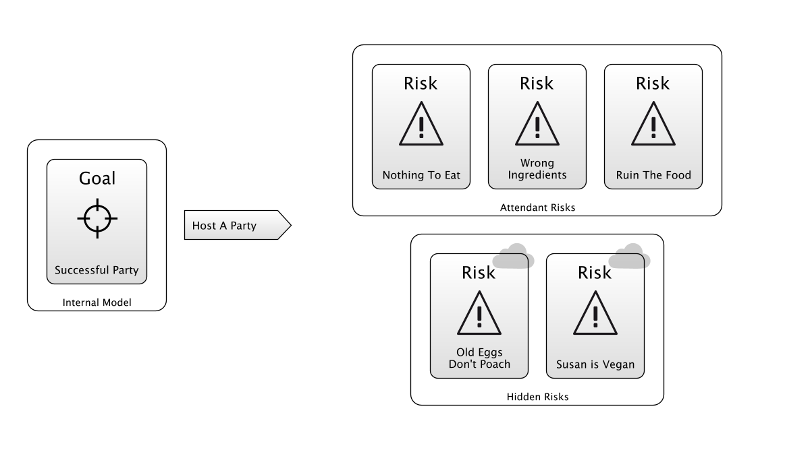

# A Simple Scenario

In this section, I'm going to introduce some terms for thinking about risk.

For a moment forget about software completely, and think about _any endeavour at all_ in life.  It could be passing a test, mowing the lawn or going on holiday.  Choose something now.   I'll discuss from the point of view of "cooking a meal for some friends", but you can play along with your own example.  

## Goal In Mind

Now, in this endeavour, we want to be successful.  That is to say, we have a **[Goal In Mind](Glossary#Goal-In-Mind)**:  we want our friends to go home satisfied after a decent meal, and not to feel hungry.   As a bonus, we might also want to spend time talking with them before and during the meal.  So, now to achieve our [Goal In Mind](Glossary#Goal-In-Mind) we *probably* have to do some tasks.  

Since our goal only exists _in our head_, we can say it is part of our **[Internal Model](Glossary#Internal-model)** of the world.  That is, the model we have of reality.  This model extends to _predicting what will happen_.

If we do nothing, our friends will turn up and maybe there's nothing in the house for them to eat.   Or maybe, the thing that you're going to cook is going to take hours and they'll have to sit around and wait for you to cook it and they'll leave before it's ready.  Maybe you'll be some ingredients short, or maybe you're not confident of the steps to prepare the meal and you're worried about messing it all up.  

## Attendant Risk

These _nagging doubts_ that are going through your head are what I'll call the [Attendant Risks](Glossary#attendant-risk):  they're the ones that will occur to you as you start to think about what will happen. 

When we go about preparing for this wonderful evening, we can choose to deal with these risks:  shop for the ingredients in advance, prepare parts of the meal and maybe practice the cooking in advance.  Or, we can wing it, and sometimes we'll get lucky.

How much effort we expend on these [Attendant Risks](Glossary#attendant-risk) depends on how big we think they are.  For example, if you know there's a 24-hour shop, you'll probably not worry too much about getting the ingredients well in advance (although, the shop _could still be closed_).

## Hidden Risks

[Attendant Risks](Glossary#attendant-risk) are risks you are aware of.  You may not be able to exactly _quantify_ them, but you know they exist.  But there are also **[Hidden Risks](Glossary#attendant-risk)** that you _don't_ know about: if you're poaching eggs for dinner, perhaps you didn't know that fresh eggs poach best.  Donald Rumsfeld famously called these kinds of risks "Unknown Unknowns":

> "Reports that say that something hasn't happened are always interesting to me, because as we know, there are known knowns; there are things we know we know. We also know there are known unknowns; that is to say we know there are some things we do not know. But there are also unknown unknowns—the ones we don't know we don't know. And if one looks throughout the history of our country and other free countries, it is the latter category that tend to be the difficult ones." - [Donald Rumsfeld, _Wikipedia_](https://en.wikipedia.org/wiki/There_are_known_knowns)

Different people evaluate risks differently, and they'll also _know_ about different risks.  What is an [Attendant Risk](Glossary#attendant-risk) for one person is a [Hidden Risk](Glossary#attendant-risk) for another.     

Which risks we know about depends on our **knowledge** and **experience**, then. <!-- tweet-end --> And that varies from person to person (or team to team).  

## Meeting Reality

As the dinner party gets closer, we make our preparations, and the inadequacies of the [Internal Model](Glossary#Internal-Model) become apparent.  We learn what we didn't know and the [Hidden Risks](Glossary#hidden-risk) reveal themselves.  Other things we were worried about don't materialise.  Things we thought would be minor risks turn out to be greater.   

Our model is forced to [Meet Reality](Glossary#meet-reality), and the model changes,  forcing us to deal with these risks, as shown in the diagram above.  Whenever we try to _do something_ about a risk, it is called [Taking Action](Glossary#taking-action).  [Taking Action](Glossary#taking-action) _changes_ reality, and with it your [Internal Model](Glossary#internal-model) of the risks you're facing.  That's because it's only by interacting with the world that we add knowledge to our [Internal Model](Glossary#internal-model) about what works and what doesn't.  Even something as passive as _checking the shop opening times_ is an action, and it improves on our [Internal Model](Glossary#internal-model) of the world.

If we had a good [Internal Model](Glossary#Internal-Model), and took the right actions, we should see positive outcomes.  If we failed to manage the risks, or took inappropriate actions, we'll probably see negative outcomes.

## On To Software

Here, we've introduced some new terms that we're going to use a lot:  [Meet Reality](Glossary#meet-reality), [Attendant Risk](Glossary#attendant-risk), [Hidden Risk](Glossary#attendant-risk), [Internal Model](Glossary#Internal-model), [Taking Action](Glossary#taking-action) and [Goal In Mind](Glossary#Goal-In-Mind).  And, we've applied them in a simple scenario.

But Risk-First is about understanding risk in software development, so let's examine the scenario of a new software project, and expand on the simple model being outlined above:  instead of a single person, we are likely to have a team, and our model will not just exist in our heads, but in the code we write.  

On to [Development Process](Development-Process.md)...