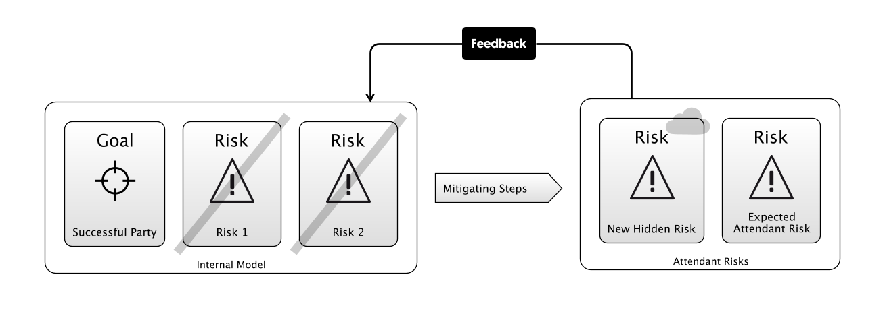
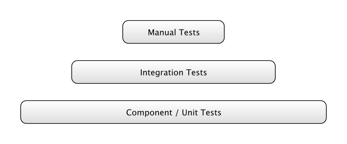
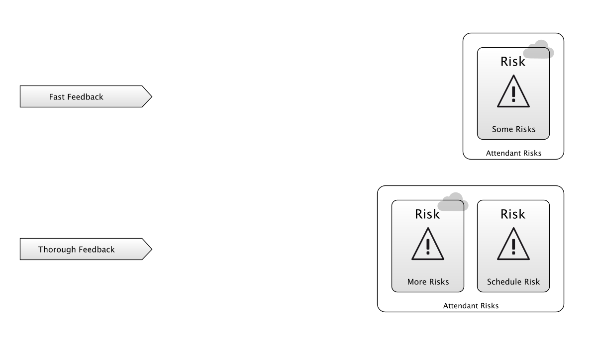

# Cadence

Let's go back to the model again, introduced in [Meeting Reality](Meeting-Reality):

As you can see, it's an idealized **Feedback Loop**.  

How _fast_ should we go round this loop?  The longer you leave your [goal in mind](Glossary#Goal-In-Mind), the longer it'll be before you find out how it really stacks up against reality.  

Testing your [goals in mind](Glossary#Goal-In-Mind) against reality early and safely is how you'll manage risk effectively, and to do this, you need to set up **Feedback Loops**. <!-- tweet-end --> e.g.

 - **Bug Reports and Feature Requests** tell you how the users are getting on with the software.
 - **[Monitoring Tools and Logs](Operational-Risk)** allow you to find out how your software is doing in reality.
 - **Dog-Fooding** i.e using the software you write yourself might be faster than talking to users.
 - **[Continuous Delivery](https://en.wikipedia.org/wiki/Continuous_delivery)** is about putting software into production as soon as it's written.   
 - **Integration Testing** is a faster way of meeting _some_ reality than continually deploying code and re-testing it manually.
 - **Unit Testing** is a faster feedback loop than Integration Testing. 
 - **Compilation** warns you about logical inconsistencies in your code.
 
.. and so on.

### Time / Reality Trade-Off

This list is arranged so that at the top, we have the most visceral, most _real_ feedback loop, but at the same time, the slowest.   

At the bottom, a good IDE can inform you about errors in your [Internal Model](Glossary#Internal-Model) in real time, by way of highlighting compilation errors .  So, this is the fastest loop, but it's the most _limited_ reality.

Imagine for a second that you had a special time-travelling machine.  With it, you could make a change to your software, and get back a report from the future listing out all the issues people had faced using it over its lifetime, instantly.

That'd be neat, eh?  If you did have this, would there be any point at all in a compiler?   Probably not, right?  

The whole _reason_ we have tools like compilers is because they give us a short-cut way to get some limited experience of reality _faster_ than would otherwise be possible.  Because, cadence is really important:  the faster we test our ideas, the more quickly we'll find out if they're correct or not.

### Development Cycle Time

Developers often ignore the fast feedback loops at the bottom of the list above, because the ones nearer the top _will do_.   In the worst cases, changing two lines of code, running the build script, deploying and then manually testing out a feature.  And then repeating.

If you're doing it over and over, this is a terrible waste of time.  And, you get none of the benefit of a permanent suite of tests to run again in the future.  

The [Testing Pyramid](http://www.agilenutshell.com/episodes/41-testing-pyramid) hints at this truth: 

- **Unit Tests** have a _fast feedback loop_, so have _lots of them_.
- **Integration Tests** have a slightly _slower feedback loop_, so have _few of them_.   Use them when you can't write unit tests (at the application boundaries).
- **Manual Tests** have a _very slow feedback loop_, so have _even fewer of them_.  Use them as a last resort.

### Production

You could take this section to mean that [Continuous Delivery](https://en.wikipedia.org/wiki/Continuous_delivery) (CD) is always and everywhere a good idea.  That's not a bad take-away, but it's clearly more nuanced than that.  

Yes, CD will give you faster feedback loops, but even getting things into production is not the whole story:   the feedback loop isn't complete until people have used the code, and reported back to the development team.  

The right answer is to use multiple feedback loops:

In the next section [De-Risking](De-Risking) we're going to introduce a few more useful terms for thinking about risk.
