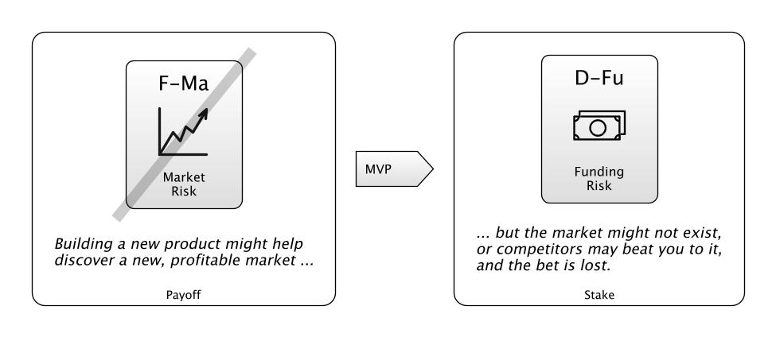

# Coding Bets

Any time you accept a new ticket, or start coding a new feature, or hunting for a bug on a software project, you're actually making a bet.  

Let's look at some examples...

## Refactoring: The Technical Debt Bet

##### "Making our codebase easier to reason about is worth the outlay of time."

Technical Debt is excess complexity in your code.  And project agility is some function of codebase complexity and embedded talent.  The bet here is that you can trade some time on the schedule to move to a place of lower complexity risk.  It looks like this:

To reduce technical debt there usually has to be some _simplifying realisation_:

> "We don't need this extra parameter to this function"

> "Class A and Class B are actually different implementations of the same functionality"

> "We can encapsulate more behaviour by introducing the command pattern".

**When you win:**
 - The codebase is easier to think about.  
 
**When you lose:** 
- The complexity risk improvement is less than you hoped,
- Or, it takes longer than expected, 
- Or it just doesn't work at all so you back it out and you've lost a week.

## Spike Solutions: The New Technology Bet

##### "A New technology is a better fit for our problem than the one we're currently using."

Quite often, someone will suggest using a new technology to either replace a poorly-performing existing technology, home-grown solution or gap in the functionality.  

But will the new technology fit?  The answer is to try to "prove" the bet as quickly as possible using a time-boxed "Spike Solution".

> "Let's replace all our uses of java.util.Date with DateTime, as it's less buggy".

> "Let's use ElasticSearch for searching instead of SQL Statements"

> "Let's use JSON here instead of XML".

**When you win:**
 - The spike solution demonstrates that the technology will fit for all of the use cases needed.
 - The spike solution demonstrates that the technology is definitely not a good fit, for clear reasons that weren't apparent before starting. 
 
**When you lose:** 
 - The developer can't get the spike solution working in the given time.  Does this prove that the technology is no good, or too complex, or that the developer needed more time, or that they're not skilled enough?
 - The developer gets the spike solution working for a specific use case, which is taken as success.  However, it later proves problematic in production, or in fitting to other use-cases.
 
**Reduce the stakes by:**

 - Tackling the hardest use-case first
 - Skipping writing tests: if it doesn't work out, they're waste.

## New Feature Bets

##### "This new feature may be exactly what our users are looking for."

Sometimes it's impossible to know exactly how the user base will feel about a new feature without building it.  So, build the feature, and test it with a trial population.

> "We need to provide an export-to-Excel function, as our competitors have one"

> "Users need to be able to customize the workflow, otherwise they'll go elsewhere"

> "We need a global search because people spend too much time menu-diving"

**When you win:**
 - The users welcome the change with open arms.  The bigger the bet, the more delight the users may experience.  
 - New markets open up.
 - Sometimes, the bet is obvious, low-hanging fruit, and the users are pleased but ultimately it was a necessary, expected change.
 
**When you lose:**  
 - The feature doesn't make much impact.  It's used often enough to not be removed, but adds Complexity Risk to the codebase.
 - You might build the feature _almost right_, and no-one notices that it could've been a lot better.
 - The feature is a diversion from the main purpose of the project, and a waste of time.  

**Reduce the stakes by:** 
 - Thoroughly triaging.
 - Building mock-ups.
 - Listening to feedback

## MVP: The New Market Bet

##### "Building a Minimum Viable Product is a bet on the market"

The idea of a Minimum Viable Product is to make a bet that a market exists for a certain product, _and that there's money to be made from it_. 

> "People will use the search engine and we can monetize it with advertising".

> "People will buy pet food online"

> "Bots are the future: let's write one for the insurance business"

**When you win:**
 - You start a new business
 
**When you lose:**  
 - Loss of credibility.
 - Funding dries up.
 

**Reduce the stakes by:** 
- Failing fast.  Implement the riskiest functionality first.
- Doing things that don't scale.  You can prove the market by doing a lot of processes manually.
- Relying on Dependencies:  for everything that isn't completely unique.

## Conclusion

This was just a few examples, but this idea is _generally_ applicable.  Look at the next piece of code you're about to write:

 - What are the stakes?
 - What is the Pay Off?
 - Is the bet worth it?  Sometimes, the stakes and the payoff are _a given_, but the bet still isn't worth the time.
 
How can you maximize the stakes while minimizing pay-off?  How long will it take for the pay-off to be worthwhile?

Are you making a long bet, or lots of small short bets?  (Split work up, then do the riskiest part first)

