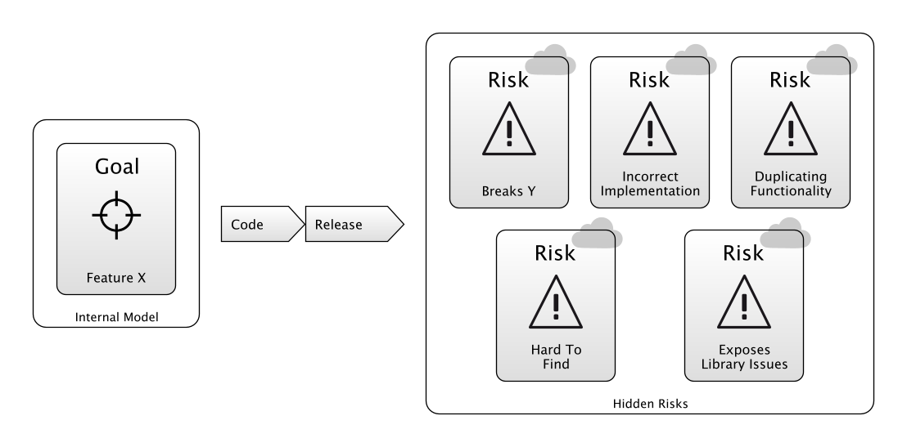
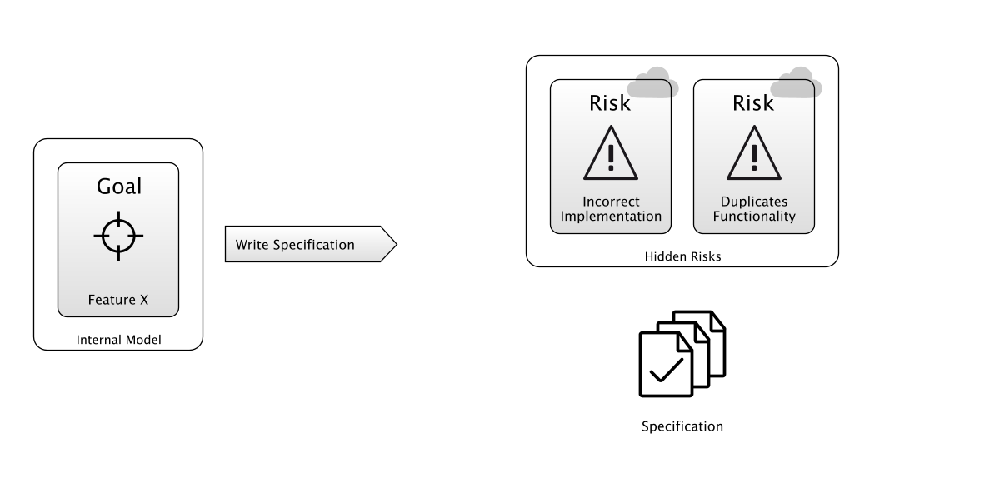
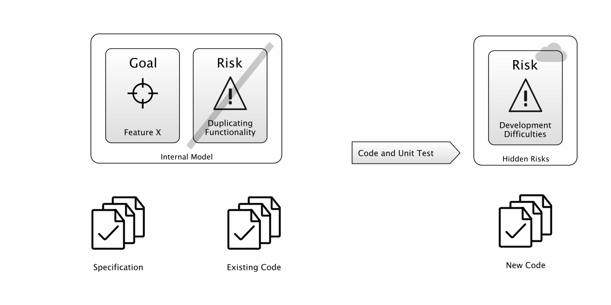
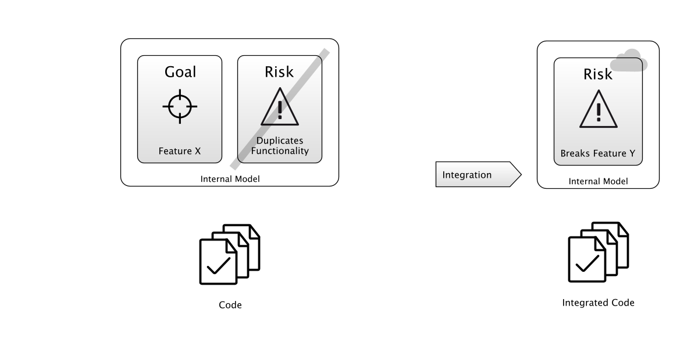
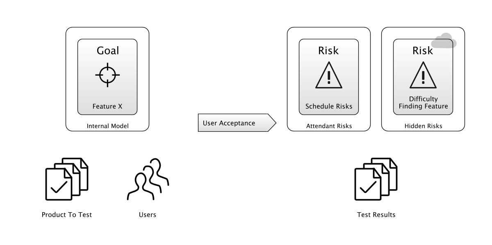

# Development Process

In the [previous section](A-Simple-Scenario) we introduced some terms for talking about risk (such as [Attendant Risk](Glossary#attendant-risk), [Hidden Risk](Glossary#attendant-risk) and [Internal Model](Glossary#Internal-model)) via a simple scenario.

Now, let's look at the everyday process of developing _a new feature_ on a software project, and see how our risk model informs it.

## A Toy Process

Let's ignore for now the specifics of what methodology is being used - we'll come to that later.  Let's say your team have settled for a process something like the following:

1.  **Specification**: a new feature is requested somehow, and a business analyst works to specify it.
2.  **Code And Unit Test**: a developer writes some code, and some unit tests.
3.  **Integration**: they integrate their code into the code base.
4.  **UAT**: they put the code into a User Acceptance Test (UAT) environment, and user(s) test it.
5.  ... All being well, the code is **Released to Production**.

### Can't We Improve This?

Is this a _good_ process?  Probably, it's not that great: you could add code review, a pilot phase, integration testing, whatever. 

Also, the _methodology_ being used might be Waterfall, it might be Agile.  We're not going to commit to specifics at this stage.    

For now though, let's just assume that _it works for this project_ and everyone is reasonably happy with it. 

We're just doing some analysis of _what process gives us_.  

### Minimising Risks - Overview

I am going to argue that this entire process is _informed by software risk_:

1.  We have _a business analyst_ who talks to users and fleshes out the details of the feature properly.   This is to minimize the risk of **building the wrong thing**.
2.  We _write unit tests_ to minimize the risk that our code **isn't doing what we expected, and that it matches the specifications**.
3.  We _integrate our code_ to minimize the risk that it's **inconsistent with the other, existing code on the project**.  
4.  We have _acceptance testing_ and quality gates generally to **minimize the risk of breaking production**, somehow.

### A Much Simpler Process

We could skip all those steps above and just do this: 

1.  Developer gets wind of new idea from user, logs onto production and changes some code directly.

We can all see this might end in disaster, but why?

Two reasons: 

1.  You're [Meeting Reality](Glossary#meet-reality) all-in-one-go:  all of these risks materialize at the same time, and you have to deal with them all at once.
2.  Because of this, at the point you put code into the hands of your users, your [Internal Model](Glossary#Internal-Model) is at its least-developed.  All the [Hidden Risks](Glossary#hidden-risk) now need to be dealt with at the same time, in production.

## Applying the Process

Let's look at how our process should act to prevent these risks materializing by considering an unhappy path, one where at the outset, we have lots of [Hidden Risks](Glossary#hidden-risk).  Let's say a particularly vocal user rings up someone in the office and asks for new **Feature X** to be added to the software.  It's logged as a new feature request, but:
  
- Unfortunately, this feature once programmed will break an existing **Feature Y**.
- Implementing the feature will use some api in a library, which contains bugs and have to be coded around.
- It's going to get misunderstood by the developer too, who is new on the project and doesn't understand how the software is used.
- Actually, this functionality is mainly served by **Feature Z**...
- which is already there but hard to find.

The diagram above shows how this plays out.

This is a slightly contrived example, as you'll see.  But let's follow our feature through the process and see how it meets reality slowly, and the [Hidden Risks](Glossary#hidden-risk) are discovered:

### Specification

The first stage of the journey for the feature is that it meets the Business Analyst (BA).  The _purpose_ of the BA is to examine new goals for the project and try to integrate them with _reality as they understands it_.  A good BA might take a feature request and vet it against his [Internal Model](Glossary#internal-model), saying something like: 

- "This feature doesn't belong on the User screen, it belongs on the New Account screen"
- "90% of this functionality is already present in the Document Merge Process" 
- "We need a control on the form that allows the user to select between Internal and External projects"

In the process of doing this, the BA is turning the simple feature request _idea_ into a more consistent, well-explained _specification_ or _requirement_ which the developer can pick up.  But why is this a useful step in our simple methodology?  From the perspective of our [Internal Model](Glossary#Internal-Model), we can say that the BA is responsible for:

- Trying to surface [Hidden Risks](Glossary#hidden-risk)
- Trying to evaluate [Attendant Risks](Glossary#attendant-risk) and make them clear to everyone on the project.

In surfacing these risks, there is another outcome:  while **Feature X** might be flawed as originally presented, the BA can "evolve" it into a specification, and tie it down sufficiently to reduce the risks.   The BA does all this by simply _thinking about it_, _talking to people_ and _writing stuff down_.

This process of evolving the feature request into a requirement is the BA's job.  From our Risk-First perspective, it is _taking an idea and making it [Meet Reality](Glossary#meet-reality)_.  Not the _full reality_ of production (yet), but something more limited.  

### Code And Unit Test

The next stage for our feature, **Feature X** is that it gets coded and some tests get written.  Let's look at how our [Goal In Mind](Glossary#Goal-In-Mind) meets a new reality:   this time it's the reality of a pre-existing codebase, which has it's own internal logic.

As the developer begins coding the feature in the software, they will start with an [Internal Model](Glossary#Internal-Model) of the software, and how the code fits into it.  But, in the process of implementing it, she is likely to learn about the codebase, and 
her [Internal Model](Glossary#Internal-Model) will develop.  

At this point, let's stop and discuss the visual grammar of the Risk-First Diagrams we've been looking at.  A Risk-First diagram shows what you expect to happen when you [Take Action](Glossary#taking-action).  The action itself is represented by the shaded, sign-post-shaped box in the middle.  On the left, we have the current state of the world, on the right is the anticipated state _after_ taking the action.

The round-cornered rectangles represent our [Internal Model](Glossary#internal-model), and these contain our view of [Risk](Glossary#Risk), whether the risks we face right now, or the [Attendant Risks](Glossary#attendant-risk) expected after taking the action.  In the diagram above, taking the action of "coding and unit testing" is expected to mitigate the risks of "Incorrect Implementation" and "Duplicating Functionality".

Beneath the internal models, we are also showing real-world tangible artifacts.  That is, the physical change we would expect to see as a result of taking action.  In the diagram above, the action will result in "New Code" being added to the project, needed for the next steps of the development process. 

### Integration

Integration is where we run _all_ the tests on the project, and compile _all_ the code in a clean environment, collecting together the work from the whole development team. 

So, this stage is about meeting a new reality: the clean build.   

At this stage, we might discover the [Hidden Risk](Glossary#Hidden-Risk) that we'd break **Feature Y**

### User Acceptance Test

Next, User Acceptance Testing (UAT) is where our new feature meets another reality: _actual users_.   I think you can see how the process works by now.  We're just flushing out yet more [Hidden Risks](Glossary#hidden-risk).

 - [Taking Action](Glossary#taking-action) is the _only_ way to create change in the world.
 - It's also the only way we can _learn_ about the world, adding to our [Internal Model](Glossary#internal-model). 
 - In this case, we discover a [Hidden Risk](Glossary#hidden-risk): the user's difficulty in finding the feature.  (The cloud obscuring the risk shows that it is hidden).
 - In return, we can _expect_ the process of performing the UAT to delay our release (this is an attendant schedule risk).   

## Observations

**First**, the people setting up the development process _didn't know_ about these _exact_ risks, but they knew the _shape that the risks take_.   The process builds "nets" for the different kinds of [Hidden Risks](Glossary#hidden-risk) without knowing exactly what they are.  

**Second**, are these really risks, or are they _problems we just didn't know about_?  I am using the terms interchangeably, to a certain extent.  Even when you know you have a problem, it's still a risk to your deadline until it's solved.  So, when does a risk become a problem?  Is a problem still just a schedule-risk, or cost-risk?  We'll come back to this question presently.

**Third**, the real take-away from this is that all these risks exist because we don't know 100% how reality is.  We don't (and can't) have a perfect view of the universe and how it'll develop.   Reality is reality, _the risks just exist in our head_.

**Fourth**, hopefully you can see from the above that really _all this work is risk management_, and _all work is testing ideas against reality_.   

In the next section, we're going to look at the concept of [Meeting Reality](Meeting-Reality) in a bit more depth.

