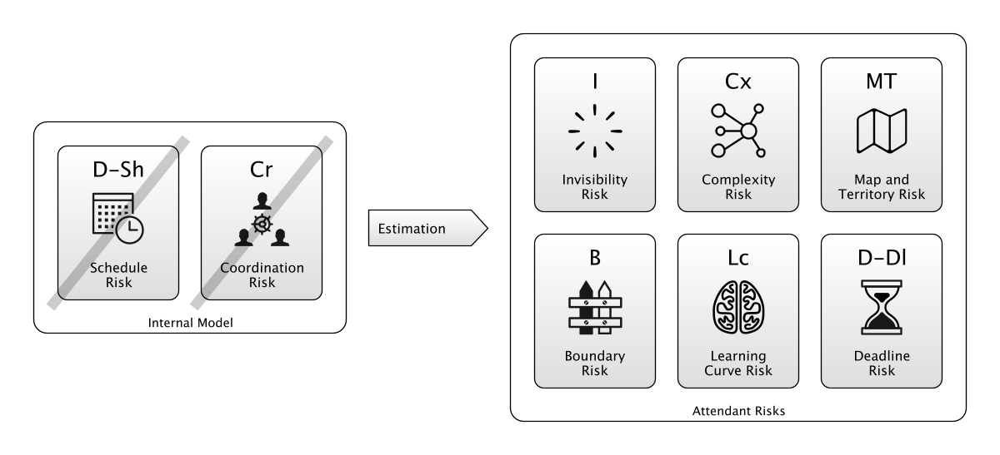
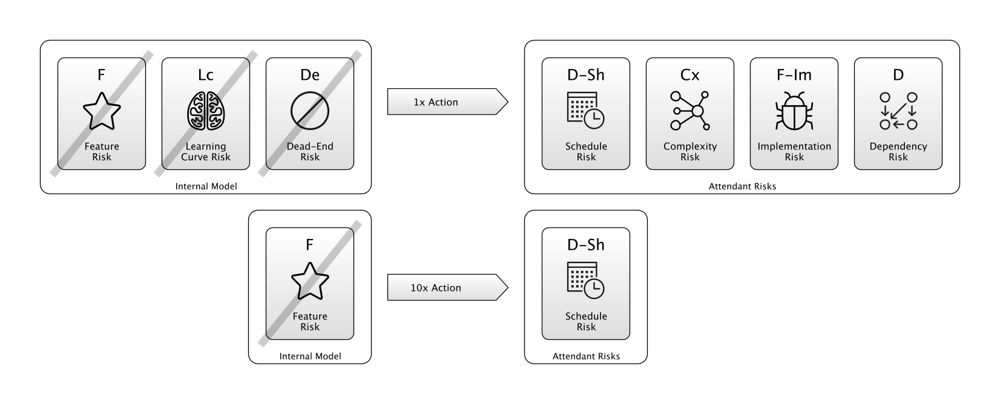
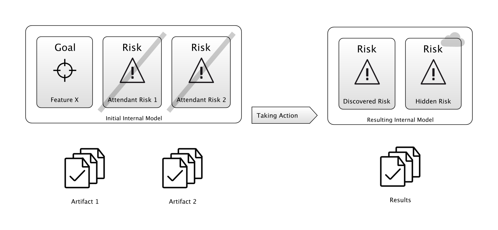
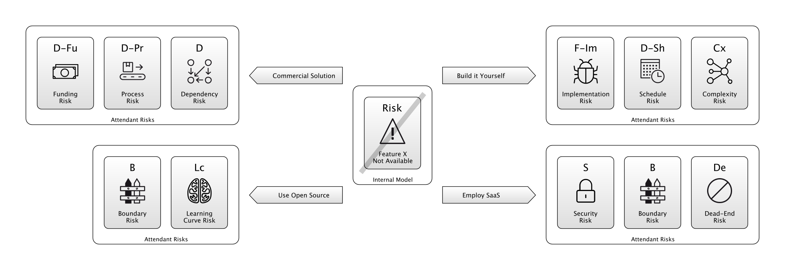

# Estimates

In this section, we're going to put a Risk-First spin on the process of [Estimating](Estimates.md).  But in order to get there, we first need to start with understanding _why_ we estimate.  We're going to look at some "Old Saws" of software estimation and what we can learn from them.  Finally, we'll bring our Risk-First [menagerie](Risk-Landscape.md) to bear on de-risking the estimation process.

## The Purpose Of Estimating

Why bother estimating at all?   There are two reasons why estimates are useful:<!-- tweet-end -->

1.  **To allow for the creation of _events_.**  As we saw in [Deadline Risk](Deadline-Risk.md), if we can put a date on something, we can mitigate lots of [Coordination Risk](Coordination-Risk.md). Having a _release date_ for a product allows whole teams of people to coordinate their activities in ways that hugely reduce the need for [Communication](Communication-Risk.md).  "Attack at dawn" allows disparate army units to avoid the [Coordination Risk](Coordination-Risk.md) inherent in "attack on my signal".  This is a _good reason for estimating_ because by using events you are mitigating [Coordination Risk](Coordination-Risk.md).  This is often called a _hard deadline_.

2.  **To allow for the estimation of the [Payoff](Glossary.md#payoff) of an [action](Glossary.md#taking-action).**  This is a _bad reason for estimating_ as we will discuss in detail below.  But briefly the main issue is that [Payoff](Glossary.md#payoff) isn't just about figuring out [Schedule Risk](Scarcity-Risk.md#schedule-risk) - you should be looking at all the other [Attendant Risks](Glossary.md#attendant-risk) of the action too.  

## How Estimates Fail

Estimates are a huge source of contention in the software world:

> "Typically, effort estimates are over-optimistic and there is a strong over-confidence in their accuracy. The mean effort overrun seems to be about 30% and not decreasing over time." - [Software Development Effort Estimation, _Wikipedia_](https://en.m.wikipedia.org/wiki/Software_development_effort_estimation).

In their research "Anchoring and Adjustment in Software Estimation", [Aranda and Easterbrook](http://www.cs.toronto.edu/%7Esme/papers/2005/ESEC-FSE-05-Aranda.pdf) asked developers split into three groups (A, B and Control) to give individual estimates on how long a piece of software would take to build.   They were each given the same specification.  However:

- Group A was given the hint: "I admit I have no experience with software, but I guess it will take about two months to finish".
- Group B were given the same hint, except with _20_ months.

How long would members of each group estimate the work to take?  The results were startling.  On average,
  
  - Group A estimated 5.1 months.
  - The Control Group estimated 7.8 months.
  - Group B estimated 15.4 months.
  
The anchor mattered more than experience, how formal the estimation method, or anything else.  _We can't estimate time at all_. 

## Is Risk To Blame?

Why is it so bad?  The problem with a developer answering a question such as:

> "How long will it take to deliver X?"

Seems to be the following:

 - The developer and the client likely don't agree on exactly what X is, and any description of it is inadequate anyway ([Invisibility Risk](Communication-Risk.md#invisibility-risk)).
 - The developer has a less-than-complete understanding of the environment he will be delivering X in ([Complexity Risk](Complexity-Risk.md) and [Map And Territory Risk](Map-And-Territory-Risk.md)).
 - The developer has some vague ideas about how to do X, but he'll need to try out various approaches until he finds something that works ([Boundary Risk](Boundary-Risk.md) and [Learning Curve Risk](Communication-Risk.md#learning-curve-risk)).
 - The developer has no idea what [Hidden Risk](Glossary.md#hidden-risk) will surface when he starts work on it.
 - The developer has no idea what will happen if he takes too long and misses the date by a day/week/month/year ([Schedule Risk](Scarcity-Risk.md#schedule-risk)).
 - The developer now has a [Deadline](Deadline-Risk.md)

... and so on.  This is summarised in the above diagram.  It's no wonder people hate estimating: the treatment is worse than the disease.

So what are we to do?  It's a problem as old as software itself, and in deference to that, let's examine the estimating problem via some "Old Saws".

## Old Saw No. 1: The "10X Developer"

> "A 10X developer is an individual who is thought to be as productive as 10 others in his or her field. The 10X developer would produce 10 times the outcomes of other colleagues, in a production, engineering or software design environment." - [10X Developer, _Techopedia_](https://www.techopedia.com/definition/31673/10X-developer)

Let's try and pull this apart:

 - How do we measure this "productivity"?  In Risk-First terms, this is about taking action to change our current position on the [Risk Landscape](Glossary.md#risk-landscape) to a position of more favourable risk.  A "10X Developer" then must be able to take actions that have much higher [Payoff](Glossary.md#payoff) than a "1X Developer".  That is, mitigating more [existing risk](Glossary.md#risk), and generating less [Attendant Risk](Glossary.md#attendant-risk).  
 - It stands to reason then, that someone [taking action](Glossary.md#taking-action) _faster_ will be leaving us with less [Schedule Risk](Scarcity-Risk.md#schedule-risk).
 - However, if they are _more expensive_, they may leave us with greater [Funding Risk](Scarcity-Risk.md#funding-risk) afterwards.
 - But [Schedule Risk](Scarcity-Risk.md#schedule-risk) isn't the only risk being transformed:   the result might be bugs, expensive new dependencies or spaghetti-code complexity.
 - The "10X" developer _must_ also leave behind less of these kind of risks too.
 - That means that the "10X Developer" isn't merely faster, but _taking different actions_.  They are able to use their talent and experience to see actions with greater Payoff than the 1X Developer.  
 

Does the "10X Developer" even exist?  Crucially, it would seem that such a thing would be predicated on the existence of the "1X Developer", who gets "1X" worth of work done each day.  It's not clear that there is any such thing as an average developer who is mitigating risk at an average rate.  

Even good developers have bad days, weeks or projects.  [Taking Action](Glossary.md#taking-action) is like placing a bet.  Sometimes you lose and the [Payoff](Glossary.md#payoff) doesn't appear:

 - The Open-Source software you're trying to apply to a problem doesn't solve it in the way you need.
 - A crucial use-case of the problem turns out to change the shape of the solution entirely, leading to lots of rework.
 - An assumption about how network security is configured turns out to be wrong, leading to a lengthy engagement with the infrastructure team.

The easiest way to be the "10X developer" is to have _done the job before_.  If you're coding in a familiar language, with familiar libraries and tools, delivering a cookie-cutter solution to a problem in the same manner you've done several times before, then you will be a "10X Developer" compared to _you doing it the first time_ because:

 - There's no [Learning Curve Risk](Communication-Risk.md#learning-curve-risk), because you have already learnt everything.
 - There's no [Dead End Risk](Complexity-Risk.md#dead-end-risk) because you already know all the right choices to make and all the right paths to take on the [Risk Landscape](Glossary.md#risk-landscape).     

## Old Saw No. 2: Quality, Speed, Cost: Pick Any Two

> "The Project Management Triangle (called also the Triple Constraint, Iron Triangle and Project Triangle) is a model of the constraints of project management. While its origins are unclear, it has been used since at least the 1950s.  It contends that: 
> 1. The quality of work is constrained by the project's budget, deadlines and scope (features).
> 2. The project manager can trade between constraints.
> 3. Changes in one constraint necessitate changes in others to compensate or quality will suffer."
>    - [Project Management Triangle, _Wikipedia_](https://en.wikipedia.org/wiki/Project_management_triangle)

From a Risk-First perspective, we can now see that this is an over-simplification.  If _quality_ is a [Feature Fit](Feature-Risk.md) metric, _deadlines_ is [Schedule Risk](Scarcity-Risk.md#schedule-risk) and _budget_ refers to [Funding Risk](Scarcity-Risk.md#funding-risk) then that leaves us with a lot of risks unaccounted for:

 - I can deliver a project in very short order by building a bunch of screens that _do nothing_ (accruing _stunning_ levels of [Implementation Risk](Feature-Risk.md#implementation-risk) as I go). 
 - Or, by assuming a lottery win, the project's budget is fine.  (Although I would have _huge_ [Funding Risk](Scarcity-Risk.md#funding-risk) because _what are the chances of winning the lottery?_)  
 - Brooks' Law (see the diagram above) contradicts the iron triangle by saying you can't trade budget for deadlines:
 
> "Brooks' law is an observation about software project management according to which 'adding human resources to a late software project makes it later'. - [Brooks Law, _Wikipedia_](https://en.wikipedia.org/wiki/Brooks_law)

So the conclusion is:  **Focusing on the three risks of the iron triangle isn't enough.**  You can game these risks by sacrificing others:  we need to be looking at the project's risk _holistically_.

 - There's no point in calling a project complete if the dependencies you are using are [unreliable](Dependency-Risk.md) or [undergoing rapid change](Scarcity-Risk.md#red-queen-risk) 
 - There's no point in delivering the project on time if it's an [Operational Risk](Operational-Risk.md) nightmare, and requires constant round-the-clock support and will cost a fortune to _run_.  (Working on a project that "hits its delivery date" but is nonetheless a broken mess once in production is too common a sight.)
 - There's no point in delivering a project on-budget if [the market has moved on](Feature-Risk.md#market-risk) and [needs different features](Feature-Risk.md#feature-drift-risk).  

## Old Saw No. 3: Parkinson's Law

> "Parkinson's law is the adage that 'work expands so as to fill the time available for its completion'." - [Parkinson's Law, _Wikipedia_](https://en.wikipedia.org/wiki/Parkinsons_law)  

Let's leave aside the [Devil Makes Work-style Agency Risk](Agency-Risk.md#devil-makes-work) concerns this time.  Instead, let's consider this from a Risk-First perspective.  _Of course_ work would expand to fill the time available:  _Time available_ is an _absence of [Schedule Risk](Scarcity-Risk.md#schedule-risk)_.  It's always going to be sensible to exchange free time to reduce more serious risks.  

This is why projects will _always_ take at least as long as is budgeted for them.   <!-- tweet-end -->

### A Case Study

Let's look at a quick example of this in action, taken from [Rapid Development by Steve McConnell](http://amzn.eu/d/eTWKOsK).  At the point of this excerpt, Carl (the Project Manager) is discussing the schedule with Bill, the project sponsor: 

> "I think it will take about 9 months, but that's just a rough estimate at this point," Carl said. "That's not going to work," Bill said. "I was hoping you'd say 3 or 4 months. We absolutely need to bring that system in within 6 months. Can you do it in 6?"   `(1)`

Later in the story, the schedule has slipped twice and is about to slip again:

> ... at the 9-month mark, the team had completed detailed design, but coding still hadn't begun on some modules. It was clear that Carl couldn't make the 10-month schedule either. He announced the _third schedule slip_ to 12 months. Bill's face turned red when Carl announced the slip, and the pressure from him became more intense.   `(2)`

At point `(2)`, Carl has tried to mitigate [Feature Risk](Feature-Risk.md) by increasing [Schedule Risk](Scarcity-Risk.md#Schedule-Risk), although he knows that Bill will trust him less for doing this, as shown in the diagram above.  Let's continue...

> Carl began to feel that his job was on the line. Coding proceeded fairly well, but a few areas needed redesign and reimplementation. The team hadn't coordinated design details in those areas well, and some of their implementations conflicted. At the 11-month oversight-committee meeting, Carl announced the fourth schedule slip— to 13 months. Bill became livid. "Do you have any idea what you're doing?" he yelled. "You obviously don't have any idea! You obviously don't have any idea when the project is going to be done! I'll tell you when it's going to be done! It's going to be done by the 13-month mark, or you're going to be out of a job! I'm tired of being jerked around by you software guys! You and your team are going to work 60 hours a week until you deliver!"  `(3)`

At point `(3)` in McConnell's Case Study, the schedule has slipped again and Bill has threatened Carl's job.  Why did he do this?  Because _he doesn't trust Carl's evaluation of the [Schedule Risk](Scarcity-Risk.md#schedule-risk)_.  By telling Carl that it's his job on the line he makes sure Carl appreciates the [Schedule Risk](Scarcity-Risk.md#schedule-risk). 

However, forcing staff to do overtime is a dangerous ploy:  it could disenfranchise the staff, or cause corners to be cut, as shown in the diagram above.

> Carl felt his blood pressure rise, especially since Bill had backed him into an unrealistic schedule in the first place. But he knew that with four schedule slips under his belt, he had no credibility left. He felt that he had to knuckle under to the mandatory overtime or he would lose his job. Carl told his team about the meeting. They worked hard and managed to deliver the software in just over 13 months. Additional implementation uncovered additional design flaws, but with everyone working 60 hours a week, they delivered the product through sweat and sheer willpower. " `(4)` - [McConnell, Steve, _Rapid Development_](http://amzn.eu/d/eTWKOsK)

At point `(4)`, we see that Bill's gamble worked (for him at least):  the project was delivered by the team working overtime for two months.  This was lucky - it seems unlikely that no-one quit and that the code didn't descend into a mess in that time.  

The diagram above shows the [action taken](Glossary.md#taking-action), _working overtime_.  Despite this being a fictional (or fictionalised) example, it rings true for many projects.  What _should_ have happened at point `(1)`?  Both Carl and Bill estimated incorrectly...  Or did they?   Was this just Parkinson's Law in operation?
 
## Agile Estimation

One alternative approach, much espoused in DevOps/Agile is to pick a short-enough period of time (say, two days or two weeks) and figure out what the most meaningful step towards achieving an objective would be in that time.   <!-- tweet-end --> By fixing the time period, we remove [Schedule Risk](Scarcity-Risk.md#schedule-risk) from the equation, don't we?

Well, no.  First, how to choose the time period? [Schedule Risk](Scarcity-Risk.md#schedule-risk) tends to creep back in, in the form of something like [Person-Hours](https://en.wikipedia.org/wiki/Man-hour) or [Story Points](https://www.atlassian.com/agile/project-management/estimation): 

> "Story points rate the relative effort of work in a Fibonacci-like format: 0, 0.5, 1, 2, 3, 5, 8, 13, 20, 40, 100. It may sound counter-intuitive, but that abstraction is actually helpful because it pushes the team to make tougher decisions around the difficulty of work. " - [Story Points, _Atlassian_](https://www.atlassian.com/agile/project-management/estimation)

Second, the strategy of picking the two-day action with the greatest [Payoff](Glossary.md#payoff) is _often good_.  (After all, this is just [Gradient Descent](https://en.wikipedia.org/wiki/Gradient_descent) and that's a perfectly good way for training [Machine Learning](https://en.wikipedia.org/wiki/Machine_learning) systems.)  However, just like following a river downhill from the top of a mountain will _often_ get you to the sea, it probably won't take the shortest path and sometimes you'll get stuck at a lake.  

The choice of using gradient descent means that you have given up on [Goals](Glossary.md#goal-in-mind):  essentially, we have here the difference between "Walking towards a destination" and "Walking downhill".  Or, if you like, a planned economy and a market economy.  But, we don't live in _either_: everyone lives in some mixture of the two:  our governments _have plans_ for big things like roads and hospitals, and taxes.  Other stuff, they leave to the whims of supply and demand.   A project ends up being the same.

## Risk-First Estimating

Let's figure out what we can take away from the above experiences:

 - **From the "10X Developer" Saw**: the difference made by experience implies that a lot of the effort on a project comes from [Learning Curve Risk](Communication-Risk.md#learning-curve-risk) and [Dead End Risk](Complexity-Risk.md#dead-end-risk).  
 - **From "Quality, Speed, Cost"**: we need to be considering _all_ risks, not just some arbitrary milestones on a project plan.  Project plans can always be gamed, and you can always leave risks unaccounted for in order to hit the goals.
 - **From "Parkinson's Law"**: giving people a _time budget_, you absolve them from [Schedule Risk](Scarcity-Risk.md#schedule-risk)... at least until they realise they're going to overrun.   This gives them one less dimension of risk to worry about, but means they end up taking all the time you give them, because they are optimising over the remaining risks.
 - Finally, the lesson from **Agile Estimation** is that _just iterating_ is sometimes not as efficient as _using your intuition and experience_ to plan a more optimal path.  
 
How can we synthesise this knowledge, along with what we've learned into something that makes more sense?

#### Tip #1: Estimating Should be About _Estimating [Payoff](Glossary.md#payoff)_

For a given [action](Glossary.md#taking-action) / road-map / business strategy, what [Attendant Risks](Glossary.md#attendant-risk) are we going to have? 

  - What bets are we making about where the [market](Feature-Risk.md#market-risk) will be?
  - What [Communication Risk](Communication-Risk.md) will we face explaining our product to people?
  - What [Feature Fit](Feature-Risk.md#feature-fit-risk) risks are we likely to have when we get there?
  - What [Complexity Risks](Complexity-Risk.md) will we face building our software?  How can we avoid it ending up as a [Big Ball Of Mud](Complexity-Risk.md#Protocols-And-Types)?
  - Where are we likely to face [Boundary Risks](Boundary-Risk.md) and [Dead End Risks](Complexity-Risk.md#dead-end-risk)?

Instead of the Agile Estimation being about picking out a story-point number based on some idealised amount of work that needs to be done, it should be about surfacing and weighing up risks.  e.g:

 - "Adding this new database is problematic because it's going to massively increase our [Dependency Risk](Dependency-Risk.md)."
 - "I don't think we should have component A interacting with component B because it'll introduce extra [Communication Risk](Communication-Risk.md) which we will always be tripping over."
 - "I worry we might not understand what the sales team want and are facing [Feature Implementation Risk](Feature-Risk.md#implementation-risk).  How about we try and get agreement on a specification?"  
 

 
Essentially, this is what we are trying to capture with [Risk-First Diagrams](Just-Risk.md#goals-are-risks-too) (the diagram above being the template for this).
 
#### Tip #2: The Risk Landscape is Increasingly Complex: Utilise This

If you were travelling across London from Ealing (in the West) to Stratford (in the East) the _fastest_ route might be to take the Central Line.  You could do it via the A406 road, which would take a _bit_ longer.  It would _feel_ like you're mainly going in completely the wrong direction doing that, but it's much faster than cutting straight through London and you don't pay the congestion charge.

In terms of risk, they all have different profiles.  You're often delayed in the car, by some amount.  The tube is _generally_ reliable, but when it breaks down or is being repaired it might end up quicker to walk.  

If you were doing this same journey on foot, it's a very direct route, but would take five times longer.  However, if you were making this journey a hundred years ago that might be the only choice (horseback might be a bit faster).

 
In the software development past, _building it yourself_ was the only way to get anything done.  It was like London _before road and rail_.   Nowadays, you are bombarded with choices.  It's actually _worse than London_ because it's not even a two-dimensional geographic space and there are multitudes of different routes and acceptable destinations.  Journey planning on the software [Risk Landscape](Glossary.md#risk-landscape) is an optimisation problem _par excellence_. 

Because the modern [Risk Landscape](Glossary.md#risk-landscape) is so complex:

 - There can be orders of magnitude difference in _time_, with very little difference in destination.
 - If it's [Schedule Risk](Scarcity-Risk.md#schedule-risk) you're worried about, _Code Yourself_ isn't a great solution (for the whole thing, anyway).  "Take the tube" and at least partly use something someone built already.  There are probably multiple alternatives you can consider.
 - If no one has built something similar already, then why is that?  Have you formulated the problem properly?
 - Going the wrong way is _so much easier_.
 - Dead-Ends (like a broken Central Line) are much more likely to trip you up.
 - You need to keep up with developments in your field.   Read widely.
   
#### Tip #3: Meet Reality Early on the Biggest Risks

In getting from A to B on the [Risk Landscape](Glossary.md#risk-landscape) imagine that all the [Attendant Risks](Glossary.md#attendant-risk) are the stages of a journey.  Some might be on foot, train, car and so on.  In order for your course of action to work all the stages in the journey have to succeed.  

Although you might have to make the steps of a journey in some order, you can still mitigate risk in a different order.   For example, checking the trains are running, making sure your bike is working, booking tickets and taxis, and so on.  

The _sensible_ approach would be to test the steps _in order from weakest to strongest_.  This means working out how to meet reality for each risk in turn, in order from biggest risk to smallest.

Often, a _strategy_ will be broken up into multiple actions.  _Which are the riskiest actions?_  Figure this out, using the Risk-First vocabulary and the best experience you can bring to bear, then, perform the actions which [Payoff](Glossary.md#payoff) the biggest risks first.  

As we saw from the "10X Developer" Saw, [Learning Curve Risk](Communication-Risk.md#learning-curve-risk) and [Dead End Risk](Complexity-Risk.md#dead-end-risk), are likely to be the biggest risks.  How can we front-load this and tackle these earlier?   

 - _Having a vocabulary_ (like the one Risk-First provides) allows us to _at least talk about these_.  e.g. "I believe there is a [Dead End Risk](Complexity-Risk.md#dead-end-risk) that we might not be able to get this software to run on Linux."
 - Build mock-ups:  
   - UI wireframes allow us to bottom out the [Communication Risk](Communication-Risk.md) of the interfaces we build.  
   - [Spike Solutions](Coding.md#spike) allow us to de-risk algorithms and approaches before making them part of the main development.
   - Test the market with these and [meet reality](Glossary.md#meet-reality) early.
 - Don't pick delivery dates far in the future.  Collectively work out the biggest risks with your clients, and then arrange the next possible date to demonstrate the mitigation.  
 - Do actions _early_ that are _simple_ but are nevertheless show-stoppers.  They are as much a source of [Hidden Risk](Glossary.md#hidden-risk) as more obviously tricky actions. 

#### Tip #4: Talk Frankly About All The Risks

Let's get back to Bill and Carl.  What went wrong between points `(1)` and `(2)`?   Let's break it down:

 - **Bill _wants_ the system in 3-4 months.**  It doesn't happen.  
 - **He says it "must be delivered in 6 months", but this doesn't happen either.**  However, the world (and the project) doesn't end: _it carries on_.   What does this mean about the truth of his statement?  Was he deliberately lying about the end date, or just espousing his view on the [Schedule Risk](Scarcity-Risk.md#schedule-risk)?
 - **Carl's original estimate was 9 months.**   Was he working to this all along?  Did the initial brow-beating over deadlines at point `(1)` contribute to [Agency Risk](Agency-Risk.md) in a way that _didn't_ happen at point `(2)`?
 - **Why _did_ Bill get so angry?**  His understanding of the [Schedule Risk](Scarcity-Risk.md#schedule-risk) was, if anything, _worse_ than Carl's.  It's not stated in the account, but it's likely the [Trust Risk](Communication-Risk.md#trust--belief-risk) moved up the hierarchy:  Did his superiors stop trusting him?  Was his job at stake?
 - **How could including this risk in the discussion have improved the planning process?**  Maybe the conversation have started like this instead:

> "I think it will take about 9 months, but that's just a rough estimate at this point," Carl said. "That's not going to work," Bill said. "I was hoping you'd say 3 or 4 months.  I need to show the board something by then or I'm worried they will lose confidence in me and this project".  

> "OK," said Carl.  "But I'm really concerned we have huge [Feature Fit Risk](Feature-Risk.md#feature-fit-risk).  The task of understanding the requirements and doing the design is massive."

> "Well, in my head it's actually pretty simple, " said Bill. "Maybe I don't have the full picture, or maybe your idea of what to build is more complex than I think it needs to be.  That's a massive risk right there and I think we should try and mitigate it right now before things progress.  Maybe I'll need to go back to the board if it's worse than I think. "

#### Tip #5: Picture Worrying Futures

The Bill/Carl problem is somewhat trivial (not to mention likely fictional).  How about one from real life?  On a project I was working on in November some years ago, we had two pieces of functionality we needed: "Bulk Uploads" and "Spock Integration".  (It doesn't really matter what these are).  The bulk uploads would be useful _now_.  But, the Spock Integration wasn't due until January.  In the Spock estimation meeting I wrote the following note:

> "Spock estimates were 4, 11 and 22 until we broke it down into tasks.  Now, estimates are above 55 for the whole piece.  And worryingly, we probably don’t have all the tasks.  We know we need bulk uploads in November.  Spock is January.  So, do bulk uploads? "

The team _wanted_ to start Bulk Uploads work.  After all, from these estimates it looked like Spock could easily be completed in January.   However, the question should have been:

> "If it was February now, and we'd _got nothing done_, what would our biggest risk be?"

Missing Bulk Uploads wouldn't be a show-stopper, but missing Spock would be a huge regulatory problem.  _Start work on the things you can't miss._ 

## In Summary...

Let's recap those again, in reverse order:

- **Tip #5: Picture Worrying Futures**.  For some given future point in time, try considering which risks you _don't_ want to be facing.
- **Tip #4: Talk Frankly About All The Risks**.  Apply the Risk-First vocabulary to help.  
- **Tip #3: Meet Reality Early on the Biggest Risks**.
- **Tip #2: The Risk Landscape is Increasingly Complex**:  This means you have a wide variety of possible [actions to take](Glossary.md#taking-action), so consider all the options.
- **Tip #1: Estimating Should be About _Estimating [Payoff](Glossary.md#payoff)_**.  For your action, don't just get stuck on [Schedule Risk](Scarcity-Risk.md#schedule-risk).  Consider [the whole cast](Staging-And-Classifying.md).

