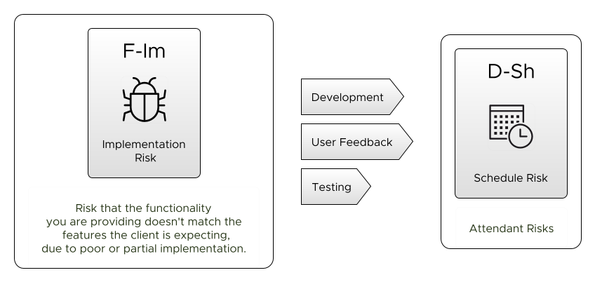
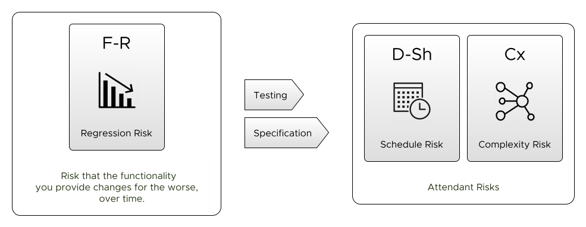
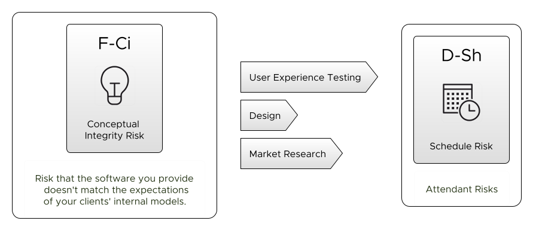
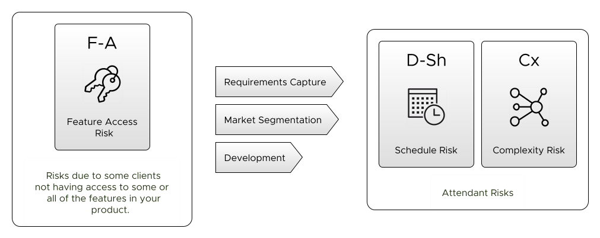
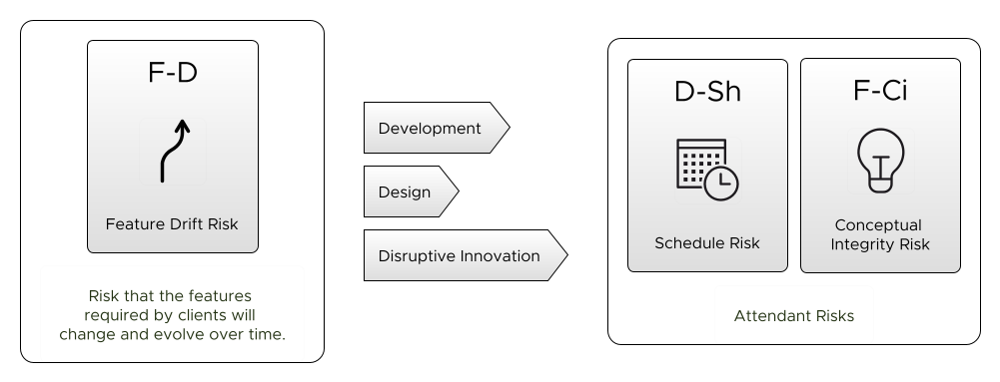
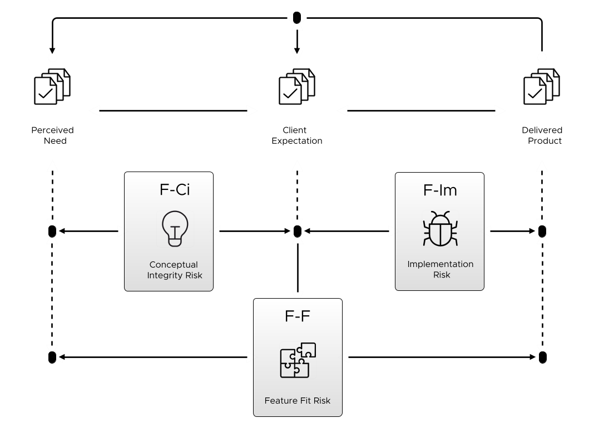
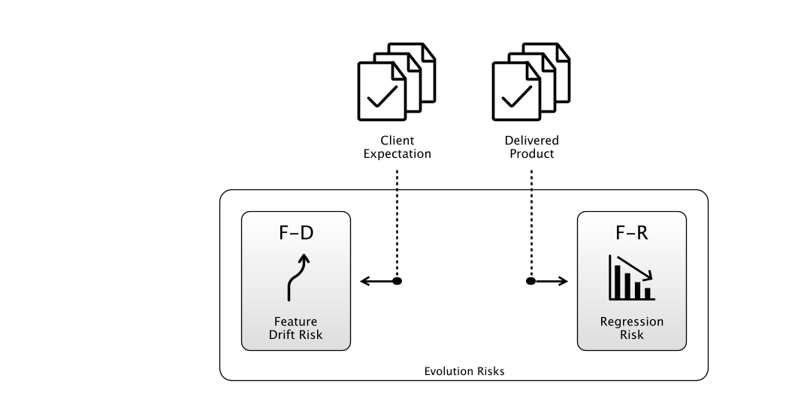

# Feature Risk

[Feature Risks](Feature-Risk.md) are risks to do with functionality that you need to have in the software you're building.  

As a simple example, <!-- tweet-start -->if your needs are served perfectly by Microsoft Excel, then it doesn't have any [Feature Risk](Feature-Risk.md).<!-- tweet-end -->  However, the day you find Microsoft Excel wanting, and decide to build an Add-On is the day when you first appreciate some [Feature Risk](Feature-Risk.md).  Now _you're_ a customer:  does the Add-On you build satisfy the requirements you have?

[Feature Risk](Feature-Risk.md) is very fundamental:  if your project has _no_ [Feature Risk](Feature-Risk.md) it would be perfect!  

As we will explore below, [Feature Risk](Feature-Risk.md) exists in the gaps between what users _want_, and what they _are given_.

Not considering [Feature Risk](Feature-Risk.md) means that you might be building the wrong functionality, for the wrong audience or at the wrong time.  And eventually, this will come down to lost money, business, acclaim, or whatever you are doing your project for.  So let's unpack this concept into some of its variations.

## Feature Fit Risk

 

This is the one we've just discussed above - the feature that clients want to use in the software _isn't there_.

 - This might manifest itself as complete _absence_ of something you need, e.g "Why is there no word count in this editor?"
 - It could be that the implementation isn't complete enough, e.g "why can't I add really long numbers in this calculator?"
 
[Feature Fit Risks](#feature-fit-risk) are mitigated by talking to clients and building things (as shown in the above diagram).  But that leads on to...
 
## Implementation Risk

 

[Feature Risk](Feature-Risk.md) also includes things that don't work as expected<!-- tweet-end -->, that is to say, [bugs](https://en.wikipedia.org/wiki/Software_bug).   Although the distinction between "a missing feature" and "a broken feature" might be worth making in the development team, we can consider these both the same kind of risk:  _the software doesn't do what the user expects_.  As shown in the above diagram, we can mitigate this risk with _feedback_ from users, as well as further _development_ and _testing_.

It's worth pointing out that sometimes, _the user expects the wrong thing_.  This is a different but related risk, which could be down to [training](Training.md), [documentation](Documentation.md) or simply a [poor user interface](Communication-Risk.md) (and we'll look at that more in [Communication Risk](Communication-Risk.md).)

## Regression Risk

 

[Regression Risk](Feature-Risk.md#regression-risk) is the risk of breaking existing features in your software when you add new ones.  <!-- tweet-end -->As with the previous risks, the eventual result is the same: customers don't have the features they expect.  This can become a problem as your code-base [gains Complexity](Complexity-Risk.md) and as it becomes impossible to keep a complete [Internal Model](Glossary.md#Internal-Model) of the whole thing in your head.

Delivering new features can delight your customers, breaking existing ones will annoy them.  This is something we'll come back to in [Operational Risk](Operational-Risk.md).

## Conceptual Integrity Risk

 

Sometimes users _swear blind_ that they need some feature or other, but it runs at odds with the design of the system, and plain _doesn't make sense_.   Often the development team can spot this kind of conceptual failure as soon as it enters the [Backlog](Prioritisation.md). Usually it's in coding that this becomes apparent.  

Sometimes it can go for a lot longer.  I once worked on some software that was built as a score-board within a chat application.  However, after we'd added much-asked-for commenting and reply features to our score-board, we realised we'd implemented a chat application _within a chat application_, and had wasted our time enormously.  

[Feature Phones](https://en.wikipedia.org/wiki/Feature_phone) are a real-life example:  although it _seemed_ like the market wanted more and more features added to their phones, [Apple's iPhone](https://en.wikipedia.org/wiki/IPhone) was able to steal huge market share by presenting a much more enjoyable, more coherent user experience, despite being more expensive and having fewer features.  Feature Phones had been drowning in increasing [Conceptual Integrity Risk](Feature-Risk.md#Conceptual-integrity-risk) without realising it.

This is a particularly pernicious kind of [Feature Risk](Feature-Risk.md) which can only be mitigated by good [Design](Design.md).  Human needs are fractal in nature: the more you examine them, the more complexity you can find.  The aim of a product is to capture some needs at a *general* level:  you can't hope to anticipate everything.  

[Conceptual Integrity Risk](Feature-Risk.md#conceptual-integrity-risk) is the risk that chasing after features leaves the product making no sense, and therefore pleasing no-one.   

## Feature Access Risk

 

Sometimes features can work for some people and not others:  this could be down to [Accessibility](https://en.wikipedia.org/wiki/Accessibility) issues, language barriers or localisation.   <!-- tweet-end -->

You could argue that the choice of _platform_ is also going to limit access:  <!-- tweet-start -->writing code for XBox-only leaves PlayStation owners out in the cold.   This is _largely_ [Feature Access Risk](Feature-Risk.md#feature-access-risk), though [Dependency Risk](Dependency-Risk.md) is related here.<!-- tweet-end -->

In marketing terms, minimising [Feature Access Risk](#feature-access-risk) is all about [Segmentation](https://en.wikipedia.org/wiki/Market_segmentation):  trying to work out _who_ your product is for, and tailoring it to that particular market.  As shown in the diagram above, mitigating [Feature Access Risk](#feature-access-risk) means increasing complexity:  you have to deliver the software on more platforms, localised in more languages, with different configurations of features.  It also means increased development effort.

## Market Risk

[Feature Access Risk](#feature-access-risk) is related to [Market Risk](Feature-Risk.md#market-risk), which I introduced in the [Risk Landscape](Risk-Landscape.md) section as being the value that the market places on a particular asset.  <!-- tweet-end -->

 

 > "Market risk is the risk of losses in positions arising from movements in market prices." - [Market Risk, _Wikipedia_](https://en.wikipedia.org/wiki/Market_risk)

I face market risk when I own (i.e. have a _position_ in) some [Apple](http://apple.com) stock. <!-- tweet-end --> [Apple's](http://apple.com) stock price will decline if a competitor brings out an amazing product, or if fashions change and people don't want their products any more.

Since the product you are building is your asset, it makes sense that you'll face [Market Risk](Feature-Risk.md#market-risk) on it: the _market_ decides what it is prepared to pay and it tends to be outside your control.     

## Feature Drift Risk

 

**Feature Drift** is the tendency that the features people need _change over time_.   For example, at one point in time, supporting IE6 was right up there for website developers, but it's not really relevant anymore.  <!-- tweet-end -->  The continual improvements we see in processor speeds and storage capacity of our computers is another example:  the [Wii](https://en.wikipedia.org/wiki/Wii) was hugely popular in the early 2000's, but expectations have moved on now.        

The point is:  [Requirements captured](Requirements-Capture.md) _today_ might not make it to _tomorrow_, especially in the fast-paced world of IT, partly because the market _evolves_ and becomes more discerning.  This happens in several ways:

 - Features present in competitors' versions of the software become _the baseline_, and they're expected to be available in your version.
 - Certain ways of interacting become the norm (e.g. [querty](https://en.wikipedia.org/wiki/QWERTY) keyboards, or the control layout in cars: these don't change with time).
 - Features decline in usefulness: _Printing_ is less important now than it was,  for example.

[Feature Drift Risk](Feature-Risk.md#feature-drift-risk) is _not the same thing_ as **Requirements Drift**, which is the tendency projects have to expand in scope as they go along.  There are lots of reasons they do that, a key one being the [Hidden Risks](Glossary.md#hidden-risk) uncovered on the project as it progresses.

## Fashion

Fashion plays a big part in IT.  By being _fashionable_, web-sites are communicating:   _this is a new thing_, _this is relevant_, _this is not terrible_.  All of which is mitigating a [Communication Risk](Communication-Risk.md).  <!-- tweet-start -->Users are all-too-aware that the Internet is awash with terrible, abandon-ware sites that are going to waste their time.  How can you communicate that you're not one of them to your users? <!-- tweet-end -->

## Delight

If this breakdown of [Feature Risk](Feature-Risk.md) seems reductive, then try not to think of it that way:  the aim _of course_ should be to delight users, and turn them into fans.  

Consider [Feature Risk](Feature-Risk.md) from both the down-side and the up-side:  

 - What are we missing?
 - How can we be _even better_?

## Analysis

So far in this section, we've simply seen a bunch of different types of [Feature Risk](Feature-Risk.md).  But we're going to be relying heavily on [Feature Risk](Feature-Risk.md) as we go on in order to build our understanding of other risks, so it's probably worth spending a bit of time up front to classify what we've found.  

The [Feature Risks](Feature-Risk.md) identified here basically exist in a space with at least 3 dimensions:

 - **Fit**: how well the features fit for a particular client.
 - **Audience**:  the range of clients (the _market_) that may be able to use this feature.
 - **Evolution**:  the way the fit and the audience changes and evolves as time goes by. 
 
Let's examine each in turn.
 
### Fit

 > "This preservation, during the battle for life, of varieties which possess any advantage in structure, constitution, or instinct, I have called Natural Selection; and Mr. Herbert Spencer has well expressed the same idea by the Survival of the Fittest" - [Charles Darwin (Survival of the Fittest), _Wikipedia_](https://en.wikipedia.org/wiki/Survival_of_the_fittest).
 
Darwin's conception of fitness was not one of athletic prowess, but how well an organism worked within the landscape, with the goal of reproducing itself.  

[Feature Fit Risk](#feature-fit-risk), [Conceptual Integrity Risk](#conceptual-integrity-risk) and [Implementation Risk](#implementation-risk) all hint at different aspects of this "fitness".   We can conceive of them as the gaps between the following entities:
 
 - **Perceived Need**,  what the developers _think_ the users want.
 - **Expectation**, what the user _expects_.
 - **Reality**, what they actually _get_.

 

For further reading, you can check out [The Service Quality Model](http://en.wikipedia.org/SERVQUAL) which the diagram above is derived from.  This model analyses the types of _quality gaps_ in services and how consumer expectations and perceptions of a service arise.

In the [Staging And Classifying](Staging-And-Classifying.md) section we'll come back and build on this model further. 

### Fit and Audience

Two risks, [Feature Access Risk](Feature-Risk.md#feature-access-risk) and [Market Risk](Feature-Risk.md#market-risk), consider _fit_ for a whole _audience_ of users.  They are different:  just as it's possible to have a small audience, but a large revenue, it's possible to have a product which has low [Feature Access Risk](#feature-access-risk) (i.e lots of users can access it without difficulty) but high [Market Risk](#market-risk) (i.e. the market is highly volatile or capricious in it's demands).  _Online services_ often suffer from this [Market Risk](#market-risk) roller-coaster, being one moment highly valued and the next irrelevant. 

 - **Market Risk** is therefore risk to _income_ from the market changing.
 - **Feature Access Risk** is risk to _audience_ changing.

### Fit, Audience and Evolution

 

Two risks further consider how the **fit** and **audience** _change_: [Regression Risk](#regression-risk) and [Feature Drift Risk](#feature-drift-risk).  We call this _evolution_ in the sense that:

 - Our product's features _evolve_ with time and the changes made by the development team.
 - Our audience changes and evolves as it is exposed to our product and competing products.
 - The world as a whole is an evolving system within which our product exists.
  
## Applying Feature Risk

Next time you are grooming the backlog, why not apply this:

 - Can you judge which tasks mitigate the most [Feature Risk](Feature-Risk.md)?
 - Are you delivering features that are valuable across a large audience?  Or of less value across a wider audience?
 - How does writing a specification mitigate [Fit Risk](Feature-Risk.md#feature-fit-risk)?  For what other reasons are you writing specifications?
 - Does the audience _know_ that the features exist?  How do you communicate feature availability to them?  
  
In the next section, we are going to unpack this last point further.  Somewhere between "what the customer wants" and "what you give them" is a _dialogue_.  In using a software product, users are engaging in a _dialogue_ with its features.  If the features don't exist, hopefully they will engage in a dialogue with the development team to get them added.  

These dialogues are prone to risk and this is the subject of the next section, [Communication Risk](Communication-Risk.md).