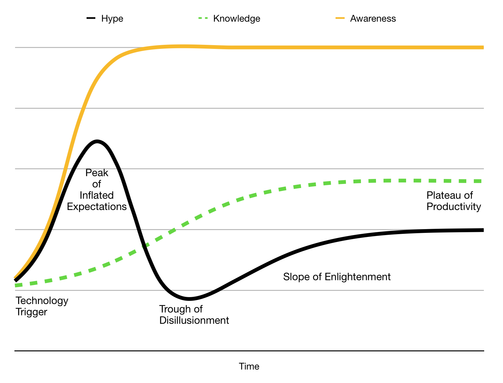
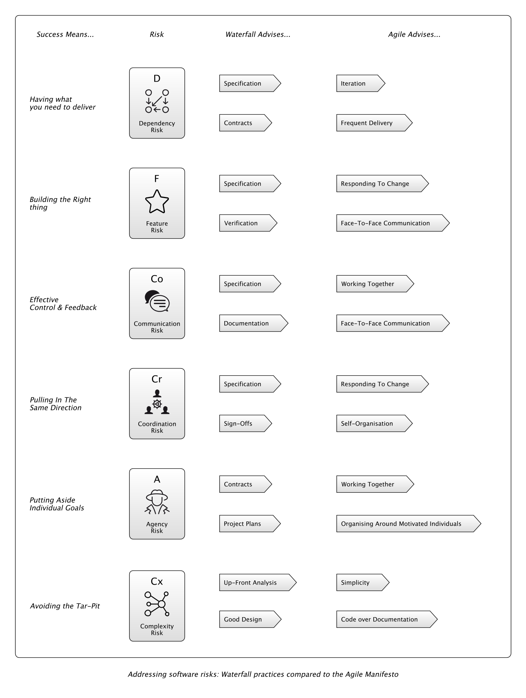

# Post-Agile

> "We are now in the “post-Agile” age.” - [Alistair Cockburn, _Heart of Agile_](https://heartofagile.com/post-agile-thoughts/)

It's been a while since the [Agile Manifesto](http://agilemanifesto.org) was signed in 2001.  

In that time, software development has seen the principles and values it contains go from being niche and hard-to-sell to completely main-stream.  

Management (with a capital-M) has finally bought into Agile techniques and industrial acceptance of Agile is everywhere.  Partly, it's because these ideas have stood the test of time, but also because it has taken a _whole generation_ of software developers who learnt about Agile 20 years ago to arrive in positions of responsibility in large organisations.

After 20 years, it seems like Agile has finally crested the [Hype-Cycle](https://riskfirst.org/Map-And-Territory-Risk#audience) and arrived at the _Peak of Inflated Expectations_.
  
But many authors on the Internet have started criticising Agile in its current state.   This short article will summarise some of the recent discussion around "Post-Agile" as a movement.  

We're going to look at four main criticisms of the Agile movement and take a look at where this nascent movement might be heading.  

## Criticism 1:  Zealotry

Early adopters of Agile were enthusiastic pioneers, pushing into new space and cautiously testing out new techniques.  But now we have two new classes of user to consider:  

- **Zealots**, who think that Agile is the answer to everything, and 
- **Reluctant Adopters**, who have Agile forced upon them.

Zealotry occurs where people see Agile as a solution to all problems, blindly following agile techniques in the belief that they will bring about success _on their own_.  This behaviour is at the heart of the Hype Cycle's Peak of Inflated Expectations:

> "How does the first line of the Agile Manifesto begin? No peeking. Don’t know? That’s fine. It doesn’t matter. It says, “We are uncovering better ways of developing software….” Stop. Notice it says, “developing software.” It does not say, “leaning out your org,” “paying down transformation debt,” “cutting it out with this command-and-control crap,” “focusing on outcomes and getting better at discovery work,” “fixing your medieval budgeting system,” or any of the other far more value-adding things people have tried to glom onto it. But the thing is, when people say that Agile pertains to the whole org, it’s revisionist history. It’s dishonest." - [Charles Lambdin, _Dear Agile, I’m Tired of Pretending_](https://medium.com/columbus-egg/dear-agile-im-tired-of-pretending-d39ab6a12003).

This zealotry is [The Peter Principle](https://en.wikipedia.org/wiki/Peter_principle) _applied to ideas_: promoting them beyond their level of competence.  

## Criticism 2:  Back To Process  

Larry Cooper and Jen Stone, authors of [Agile Value Delivery](https://leanpub.com/agilevaluedelivery-beyondthenumbers) describe these zealots as _Method Lemmings_:  
 
> "When people develop an almost religious devotion to practices they fail to see the limitations of those practices, these devotees, who Larry has named “Method Lemmings,” don’t apply the essential “inspect and adapt” concept to their practices, and they don’t connect those practices with how their organizations create value. For them inspect and adapt only applies to their outputs but not to the practices they use every day. " - [Larry Cooper and Jen Stone, _InfoQ_](https://www.infoq.com/articles/agile-value-delivery/)

But Agile is now so main-stream that project managers and business analysts everywhere are having to re-train and update their CVs to stay relevant.   On the face of it, this should be a good thing:  there is always value in learning something new.  However, there is a big difference between accepting a change in behaviour wholeheartedly and being forced into it because that's what your employers want to see.

Jonathan Kohl blogs about this too:

> "I have also seen people on Agile teams get marginalized because they aren’t Agile enough... I have seen people be pushed out of projects because they 'didn’t get Agile'. I have seen good solutions turned away because they weren’t in the white book (Extreme Programming Explained). I’ve also seen reckless, unthinking behavior justified because it was 'Agile'." - [Jonathan Kohl, Post Agilism Process Skepticism](http://www.kohl.ca/2006/post-agilism-process-skepticism/)

This is [Enforced Cargo Culting](https://en.wikipedia.org/wiki/Cargo_cult_programming#Cargo_cult_software_engineering) of Agile:  making people adopt Agile whether they want to or not.  Forcing people to adopt certain approaches is a sure-fire way to invite failure.  

## Criticism 3: Proscriptive Norms

If you were in the business of selling [Scrum](https://www.scrum.org) or [XP](http://www.extremeprogramming.org) or another popular Agile approach, one thing you would worry about is _dilution of the concept_.  When people complain that "Scrum doesn't work" is that because they _genuinely_ found it didn't work, or because _actually they weren't doing it properly_?

Certification ameliorates this problem, while also allowing a lot of money to be made along the way.  Tom Cagley makes this point:

> "Certifications are not evil.  However, they do create boundaries that slow down change.  Boundaries also constrain the evolution of the process.  Neither of these consequences, in the long run, are good.  The only long term good of hardening the boundaries around different types of Agile is that the hardening is a flag that we should begin to search the horizon for the next movement. " - [Tom Cagley, Proscriptive Norms](https://tcagley.wordpress.com/2016/12/08/post-agile-age-proscriptive-norms/)

Certifications commonly exist within industries where best practice is easily measurable.  The example Cagley gives is the tattoo industry:  failure to observe best practice around needles and blood leads to infections and disease. But while things like disease are measurable, best-practice within software development is less clear-cut.  

## Criticism 4: The Agile-Industrial Complex

Agile certification and evangelism have become big business.  Martin Fowler describes it thus:

> "The first one of these is what I would call the Agile Industrial Complex. To be fair, I'm part of it, right?  ...a lot of what is being pushed is being pushed in a way that, as I said, goes really against a lot of our precepts.  In particular, one of the really central things that impressed me very much about the early agile advocates was this realization that people are operating at the best when they choose how they want to work." - [Martin Fowler, _State Of Agile 2018_](https://martinfowler.com/articles/agile-aus-2018.html)

In particular, there is a problem with what Tom Cagley calls "Brand-Driven Ecosystems".  These tend to put _processes and tools first_:

> "Most Agile brands are based on or implemented by a tool or suite of tools... The customer-centric goals of brand-driven ecosystems are to make work and communication easier.  However, the internal business goals generally are to capture and lock customers into an ecosystem to support the economic needs to the organization(s) selling the brand ecosystem. " - [Tom Cagley, _Post-Agile Age: Brand-Driven Ecosystems_](https://tcagley.wordpress.com/2016/12/13/post-agile-age-brand-driven-ecosystems/)

Even Ken Schwaber (one of the original authors of Scrum) has begun to jump on this.  Criticising the [Scaled Agile Framework (SAFe)](https://www.scaledagileframework.com) he says:

> "They are touting their processes and tools this week at Agile 2013 in Nashville... When the signers of the Agile Manifesto got together in 2001, we wanted to share our ideas about software development... The very first tenet of it is:  'Individual and Interactions over Processes and Tools'. "  - [Ken Schwaber, _UnSAFe At Any Speed_](https://kenschwaber.wordpress.com/2013/08/06/unsafe-at-any-speed/)

## Failure Mode

So, what has gone wrong here?   A simple explanation is _money_, which tends to corrupt even the most well-meant ideas.  

As the diagram above shows, the Agile Manifesto suggested a radically different set of practices for addressing software development risks to the ones prevalent in 2001.  Consequently, as Agile gathered momentum this meant that the market for tools and techniques built around traditional practices eroded.  

That's a problem for vendors and consultants:  Many of the Agile practices (e.g. 'self-organisation' or 'face-to-face communication') would seem to be tool-proof.  Tools are easy to sell.  Processes are easy to sell.  'Responding to change'... not so much.

So, the solution was for those vendors to move their tools and processes in the direction of Agile, but at the same time, move the definition of Agile in the direction of the tools and processes.  

Ron Jeffries, another co-author of the Agile Manifesto, says:

> "Agile has become big business. Led, no doubt, by the Scrum Alliance’s successful Certified ScrumMaster offering, we now see hundreds, perhaps thousands of so-called “Agile” coaches and trainers, and many competing frameworks and methods. We see “Agile” leadership training, “Agile” project management offerings, and on and on... I really am coming to think that software developers of all stripes should have no adherence to any “Agile” method of any kind. As those methods manifest on the ground, they are far too commonly the enemy of good software development rather than its friend." - [Ron Jeffries, _Developers Should Abandon Agile_](https://ronjeffries.com/articles/018-01ff/abandon-1/)

For him, the emergent behaviours highlighted above are totally at odds with the original vision of Agile, and a cure worse than the disease.  This is akin to Microsoft's 1995 strategy to...

> "kill HTML by extending it." - [Embrace, Extend and Extinguish, _Wikipedia_](https://en.wikipedia.org/wiki/Embrace,_extend,_and_extinguish)

Good ideas tend to suffer in this way:  

 - **Democracy** is an excellent idea, [constantly under attack](https://en.wikipedia.org/wiki/Political_corruption) from the corrupting influence of money via bribes, nepotism and cronyism.  
 - **Christianity** started off with a single prophet, but [became big business](https://en.wikipedia.org/wiki/Indulgence), which led to the [reformation](https://en.wikipedia.org/wiki/Reformation).   

So are we due a reformation in the Agile world?  Fowler, Schwaber and Cockburn (quoted above, co-authors of the Agile Manifesto) think so.  

## The Trough of Disillusionment

Right now, it's easy to sell courses and certifications in Agile because it's marketed as the new silver bullet.  It's over-sold, and peoples' expectations are sky-high.  

But the backlash is the next phase of the hype-cycle: the existence of Post-Agile is a sign-post for the Trough of Disillusionment.  Reality _will_ catch up and expectations will be reset.

As with all the other hype-cycles, this too will pass.  Once Agile techniques become a mundane component of the software development tool-box, the salesmen will move onto something new, and we can get back to applying our judgement to using _good tools where they're appropriate_.

To close, perhaps Post-Agile as a concept is perhaps best summarised by Woody Zuill who says:

>  “I use the term to mean 'We accept all the good things that Agile brings, and are ready to explore and innovate beyond'. " - [Woody Zuill, _Twitter_](https://twitter.com/WoodyZuill)
