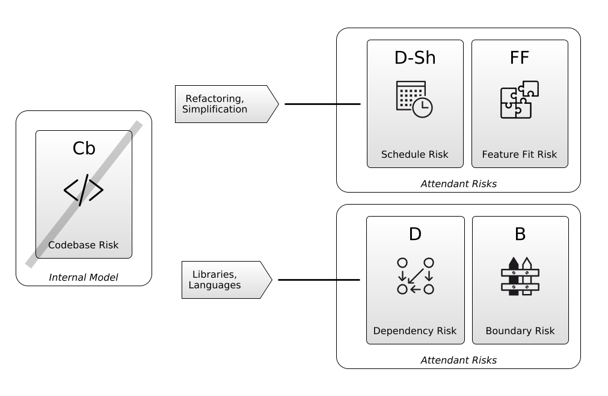
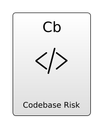
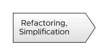
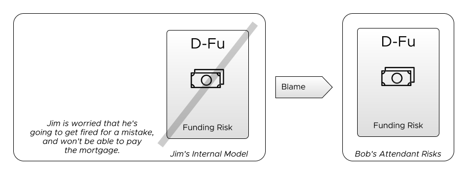
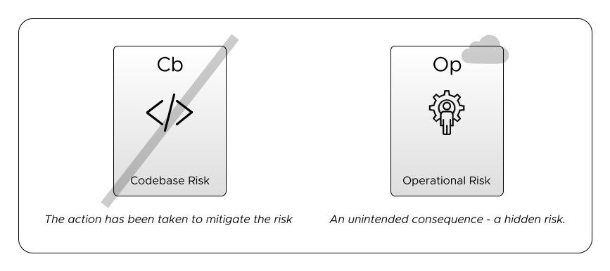

# Risk-First Diagrams Explained

What’s going on in a Risk-First diagram?    Let’s look at a quick example:

This is taken from the [Technical Debt discussion in Complexity Risk](Complexity-Risk.md#technical-debt).

What’s going on here?  Let’s work left-to right.

## On The Left

On the left, we can see [Codebase Risk](Complexity-Risk.md#codebase-risk), which is _The risk to a project of having a large, complex codebase to manage_.

Codebase Risk is an example - it could be any risk you’ve identified in your project / work / life / whatever.  It’s something you want to fix.

There are [all kinds of risks](Risk-Landscape.md) we face in life, and we attach different value or _criticality_ to them.  Most people will want to take action against the worst risks they face in their lives, and maybe put up with some of the lesser ones.

## In The Middle

In the middle, we see the actions you could take against the risk.  So for the problem of an unweildy codebase we could try and reduce the size of our codebase with some refactoring, or alternatively,  replace the whole codebase with a commercial or open-source library.  

## On The Right

_Nothing comes for free_.  On the right, you can see the downside of the action you've taken:  [Attendant Risks](Glossary.md#attendant-risk) are the _new_ risks you now have as a result of trying to deal with the first one.

It's worth pointing out that sometimes _the cure is worse than the disease_.  

By [Taking Action](Glossary.md#taking-action) you might end up in a worse predicament than you started.  For example, cutting your legs off _would definitely cure your in-growing toenail_.  We have to use our judgement to decide on the right course of action!

## Containers For _Internal Models_

The risks on the left and right are contained in rounded-boxes.  That's because risks live in our [Internal Models](Glossary.md#internal-model) - they're not real-world things you can reach out and touch.  They're _contained_ in things like brains and spreadsheets.  

In the above diagram, you can see how Jim is worried about his job security, probably because he's made a mistake at work.  Therefore, in his [Internal Model](Glossary.md#internal-model) he has [Funding Risks](Scarcity-Risk.md#funding-risk), i.e. he's worried about money.

What does he do?  His [Action](Glossary.md#taking-action) is to blame Bob.  If all goes according to plan, Jim has dealt with his risk and now Bob has the problems instead.

## What Else?

There are two other marks we use quite commonly.  

We put the strike through the risk to show that it's been dealt with, or mitigated, and the cloud icon denotes [Hidden Risks](Glossary.md#hidden-risk)- those _unknown unknowns_ that we couldn't have predicted in advance.

