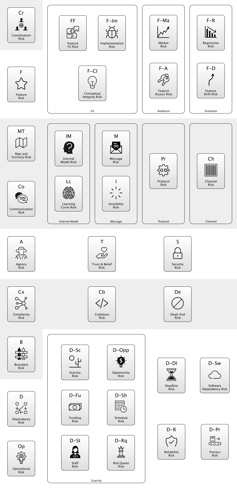
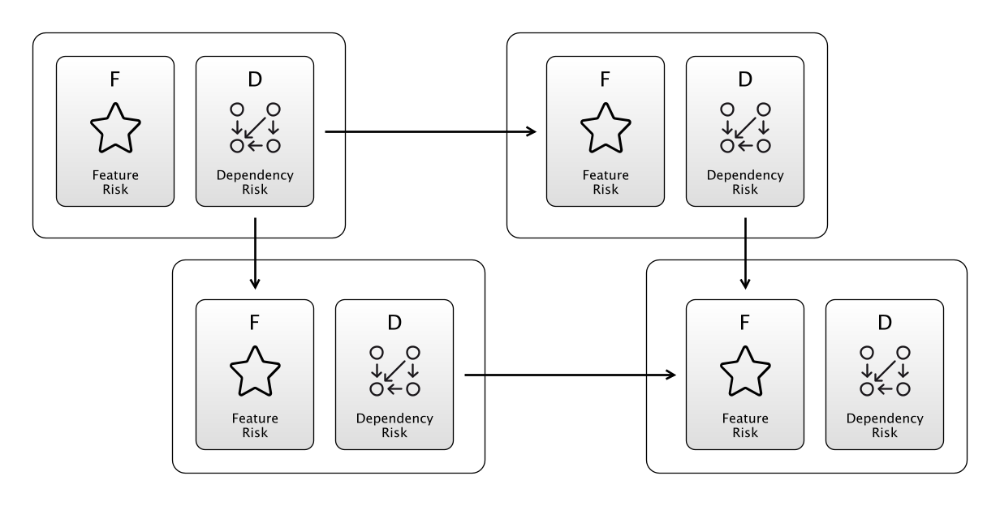

# Staging and Classifying

Our tour is complete.  

But if we are good collectors, then before we finish we should _[Stage](https://en.wikipedia.org/wiki/Entomological_equipment_for_mounting_and_storage)_ our specimens and do some work in classifying what we've seen.

## Towards A "Periodic Table" Of Risks

As we said [at the start](A-Pattern-Language.md), Risk-First is all about developing _A Pattern Language_.  We can use the terms like "[Feature Risk](Feature-Risk.md)" or "[Learning Curve Risk](Communication-Risk.md#learning-curve-risk)" to explain phenomena we see on software projects.   If we want to [De-Risk](De-Risking.md) our work, we need this power of explanation so we can talk about how to go about it.

The diagram above compiles all of the risks we've seen so far on our tour across the [Risk Landscape](Risk-Landscape.md).  Just like a periodic table, there are perhaps others left to discover.   _Unlike_ a periodic table, these risks are not completely distinct: they mix like paint and blend into one another.  

If you've been reading closely, you'll notice that a number of themes come up again and again within the different sections.   It's time to look at the _patterns within the patterns_. 

## The Power Of Abstractions

[Abstraction](Glossary.md#abstraction) appears as a concept continually: in [Communication Risk](Communication-Risk.md), [Complexity Metrics](Complexity-Risk.md#kolmogorov-complexity), [Map and Territory Risk](Map-And-Territory-Risk.md) or how it causes [Boundary Risk](Boundary-Risk.md).  We've looked at some complicated examples of abstractions, such as [network protocols](Communication-Risk.md#protocols), [dependencies on technology](Software-Dependency-Risk.md#software-tools) or [Business Processes](Process-Risk.md#the-purpose-of-process).

Let's now _generalize_ what is happening with abstraction.  To do this, we'll consider the simplest example of abstraction:  _naming a pattern_ of behaviour we see in the real world, such as "Binge Watching" or "Remote Working", or naming a category of insects as "Beetles".

### Using A Known Abstraction

As shown in the above diagram, _using an abstraction you already know_ means:

 - **Mitigating [Feature Risk](Feature-Risk.md)**: because the abstraction is providing you with something _useful_.  For example, using the word "London" allows you to refer to a whole (but slightly non-specific) geographic area.
 - **Accepting [Communication Risk](Communication-Risk.md)**: because if you are using the abstraction in conversation the people you are using it with _need to understand it too_.
 - **Accepting [Map and Territory Risk](Map-And-Territory-Risk.md)**: because the abstraction is a simplification and not the actual thing itself.
 - **Living with [Dependency Risks](Dependency-Risk.md)**:  we depend on a word in our language (or a function in our library, or a service on the Internet).  But words are [unreliable](Dependency-Risk.md#reliability-risk).  Language _changes_ and _evolves_, and the words you are using now might not always mean what you want them to mean.  (Software too changes and evolves:  We've seen this in [Red Queen Risk](Scarcity-Risk.md#red-queen-risk) and [Feature Drift Risk](Feature-Risk.md#feature-drift-risk).)
 
### Inventing A New Abstraction  

As shown in the above diagram, _inventing a new abstraction_ means:

- **Mitigating [Feature Risk](Feature-Risk.md).**  By _giving a name to something_ (or building a new product, or a way of working) you are offering up something that someone else can use.  This should mitigate [Feature Risk](Feature-Risk.md) in the sense that other people can choose to use your it, if it fits their requirements.  
- **Creating a [Protocol](Communication-Risk.md#protocols).**  Introducing _new words to a language_ creates [Protocol Risk](Communication-Risk.md#protocol-risk) as most people won't know what it means. 
- **Increasing [Complexity Risk](Complexity-Risk.md).** Because, the more words we have, the more complex the language is.
- **Creating the opportunity for [Boundary Risk](Boundary-Risk.md).**  By naming something, you _implicitly_ create a boundary, because the world is now divided into "things which _are_ X" and "things which _are not_ X".  _Boundary Risk arises from abstractions._
    
### Learning A New Abstraction

As shown in the above diagram, _learning a new abstraction_ means:

 - **Overcoming a [Learning Curve](Communication-Risk.md#learning-curve-risk)**: because you have to _learn_ a name in order to use it (whether it is the name of a function, a dog, or someone at a party).
 - **Accepting [Boundary Risks](Boundary-Risk.md).**  Commitment to one abstraction over another means that you have the opportunity cost of the other abstractions that you could have used.
 - **Accepting [Map And Territory Risk](Map-And-Territory-Risk.md).** Because the word refers to the _concept_ of the thing, and _not the thing itself_.

Abstraction is everywhere and seems to be at the heart of what our brains do.  But clearly, like [taking any other action](Glossary.md#taking-action) there is always trade-off in terms of risk.   

## Your Feature Risk is Someone Else's Dependency Risk

In the [Feature Risk](Feature-Risk.md) section, we looked at the problems of _supplying something for a client to use as a dependency_:  you've got to satisfy a demand ([Market Risk](Feature-Risk.md#market-risk)) and service a segment of the user community ([Feature Access Risk](Feature-Risk.md#feature-access-risk)).    

However over the rest of the [Dependency Risk](Dependency-Risk.md) sections we looked at this from the point of view of _being a client of someone else_:  you want to find trustworthy, reliable dependencies that don't give up when you least want them to.

So [Feature Risk](Feature-Risk.md) and [Dependency Risk](Dependency-Risk.md) are _two sides of the same coin_, they capture the risks in _demand_ and _supply_.   

As shown in the diagram above, relationships of features/dependencies are the basis of [Supply Chains](https://en.wikipedia.org/wiki/Supply_chain) and the world-wide network of goods and services that forms the modern economy.  The incredible complexity of this network mean incredible [Complexity Risk](Complexity-Risk.md), too.  Humans are masters at [coordinating](Coordination-Risk.md) and managing our dependencies. 

## The Work Continues

On this journey around the [Risk Landscape](Risk-Landscape.md) we've collected a (hopefully) good, representative sample of [Risks](Glossary.md#Risk) and where to find them. But there are more out there.   How many of these have you seen on your projects?  What is missing?  What is wrong?

Please help by reporting back what you find.

