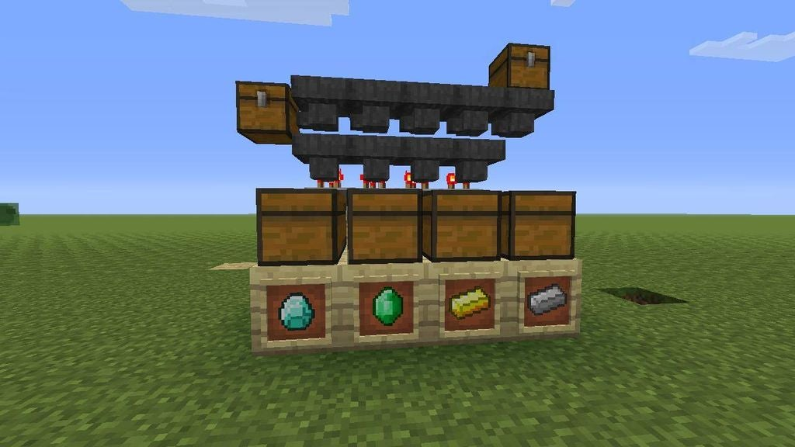
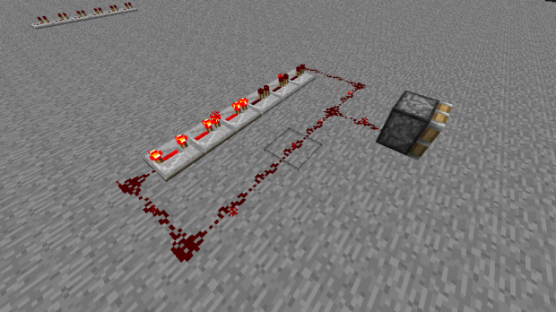
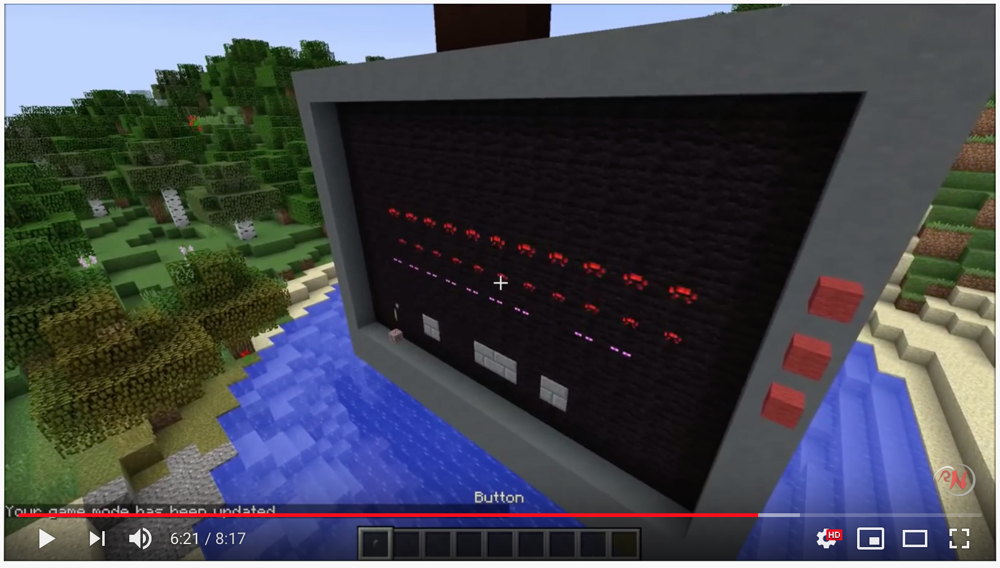
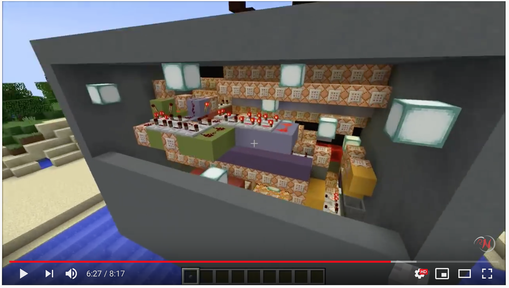
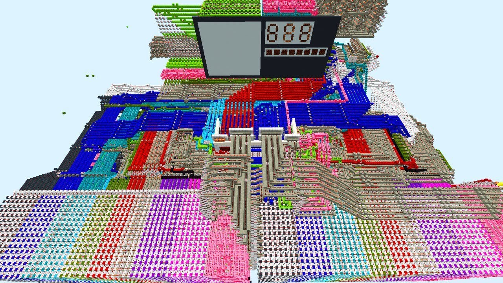
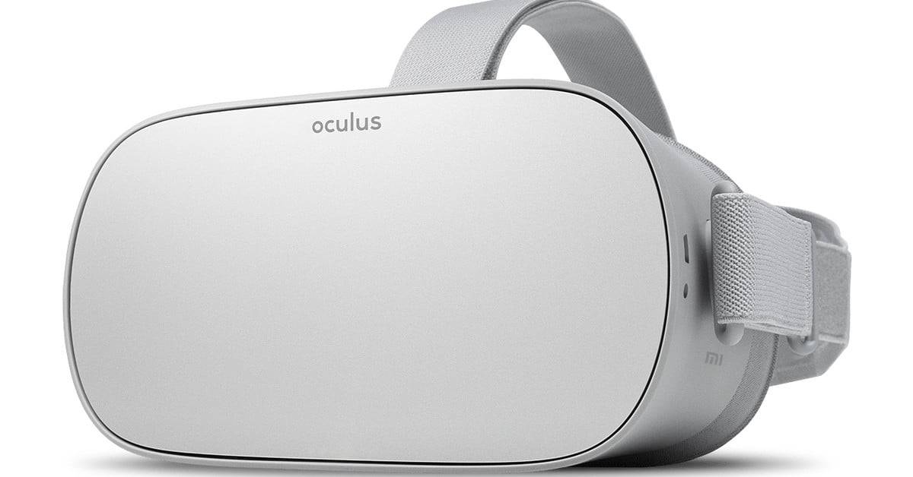

# 3D Programming

I was watching a Minecraft video the other day with my son, in which the designers had built a simple sorting algorithm:  you filled up a chest with items (food, weapons, building materials, for example) and then (somehow) the items got sorted into further, output chests.

If you want, you can follow an [Instructable and build one yourself](https://www.instructables.com/id/Minecraft-Sorting-System/)

It was very clever, and whilst I have a tenuous grasp on the concepts of using "Redstone", I had little idea of how it worked.  Redstone is Minecraft's way of constructing something akin to circuit board logic.  Here's a picture of some Redstone, for reference:

Redstone "programming" contains a lot of the features you'd recognise in a regular programming:

 - A simple system of **types**, albeit constrained to the things you'd find in the Minecraft universe, such as sheep, gold, arrows etc.
 - **Message passing** in the form of Redstone signals, which pass along tracks that you construct much like lines on a circuit board (except, in 3D).
 - **Time** and **Repetition**:  in a way, you can view Minecraft as a [Finite State Machine](https://en.wikipedia.org/wiki/Finite-state_machine) or a [Cellular Automata](https://en.wikipedia.org/wiki/Cellular_automaton) in which the state of the world evolves according to hard-and-fast rules.
 - **Decision Making**:  you can build logic gates in Redstone, or generate signals based on items being in certain places, or whether it is daylight and so on.
 
But Minecraft is an _awful_ environment to program in because:

 - There's no **encapsulation**, and it's easy to have different bits of Redstone affecting one another.
 - There's no concept of **abstraction**:  you can't build big things by referring to smaller things, you have to build everything over again each time you need it.

Nevertheless, people have coded some quite cool things in Minecraft, such as Space Invaders.  Here's the view from the front:

And here's the innards view at the back:

Further, it seems Redstone is (arguably) [Turing Complete](https://en.m.wikipedia.org/wiki/Turing_completeness), meaning you can write any algorithm in it, like building a computer, for example:

Or, you can try to implement [Minecraft in Minecraft]:

## 2D Programming

How many dimensions does normal programming have?  Generally speaking, when we program, we use a fixed-width font, so that we are manipulating a 2D array of text characters.  So arguably, we're 2D programming.

There's an argument that it's _less_ than this though:  vertical positioning is usually used for clarity rather than for meaning.  Although it's confusing for humans, you can write a Javascript program without needing new-line characters at all.

Normal programming is usually based on manipulating an AST (Abstract Syntax Tree), and trees have a [Fractal (or fractional)](https://en.wikipedia.org/wiki/Hausdorff_dimension) dimensionality, so actually it's somewhere between 1 and 2 dimensions (a [Sierpinski Gasket](https://en.wikipedia.org/wiki/Hausdorff_dimension#Examples) has 1.5 dimensions).

So first open question is:  _could using more dimensions help programming?_  Could something like [The Oculus Go](https://www.oculus.com/go/) change how we program by opening up the ability to visualize our code in more dimensions?  Or would more dimensions actually make things worse?  What do you think?

