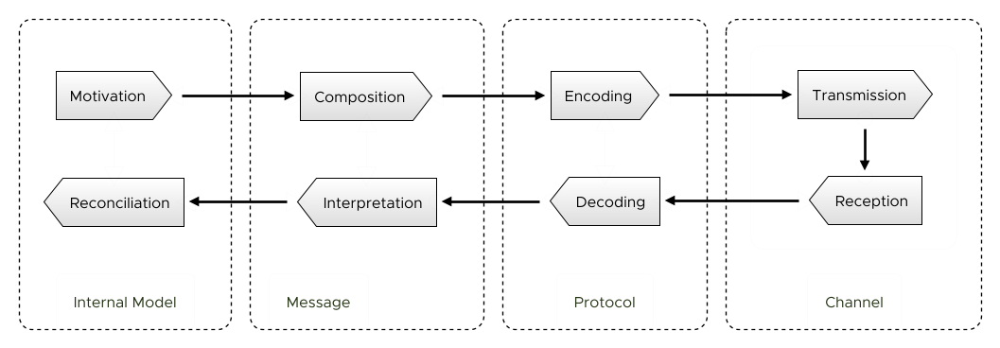
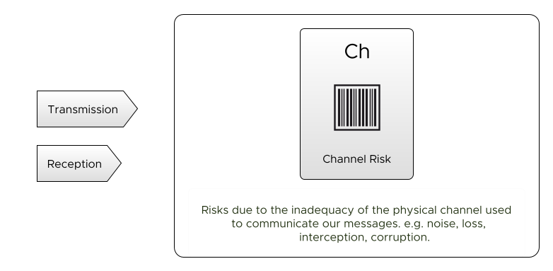
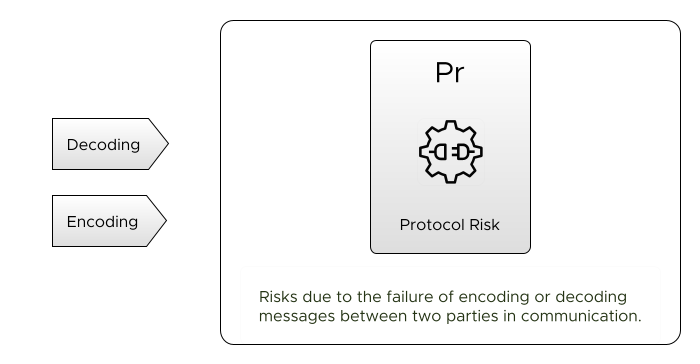
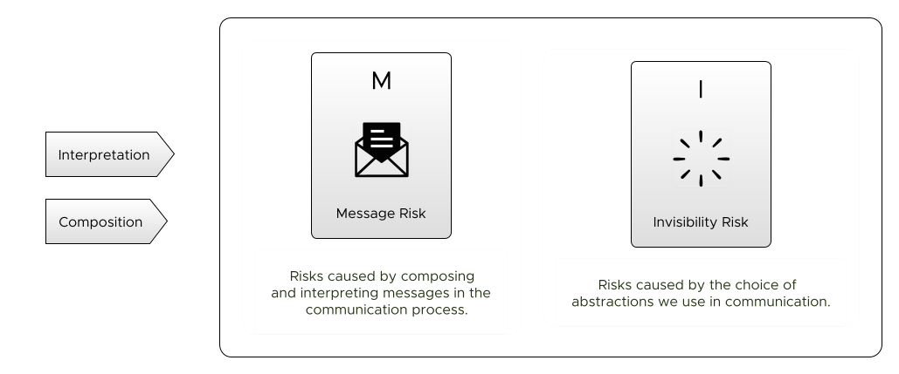
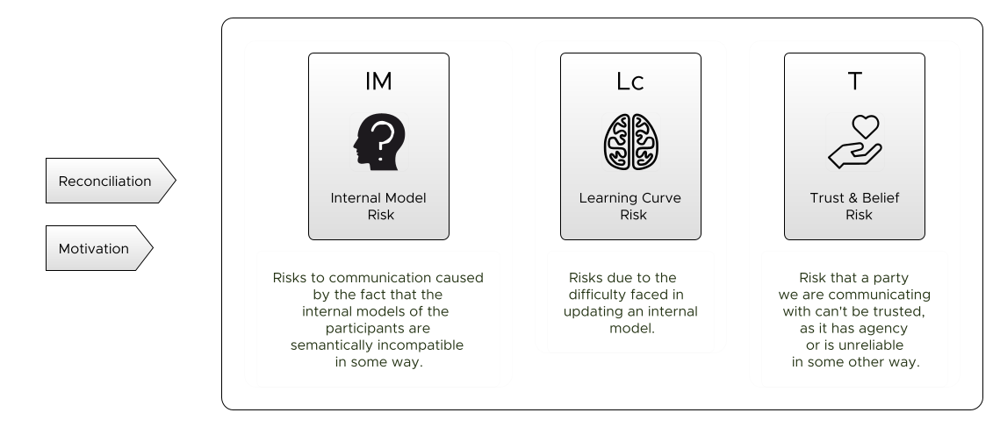
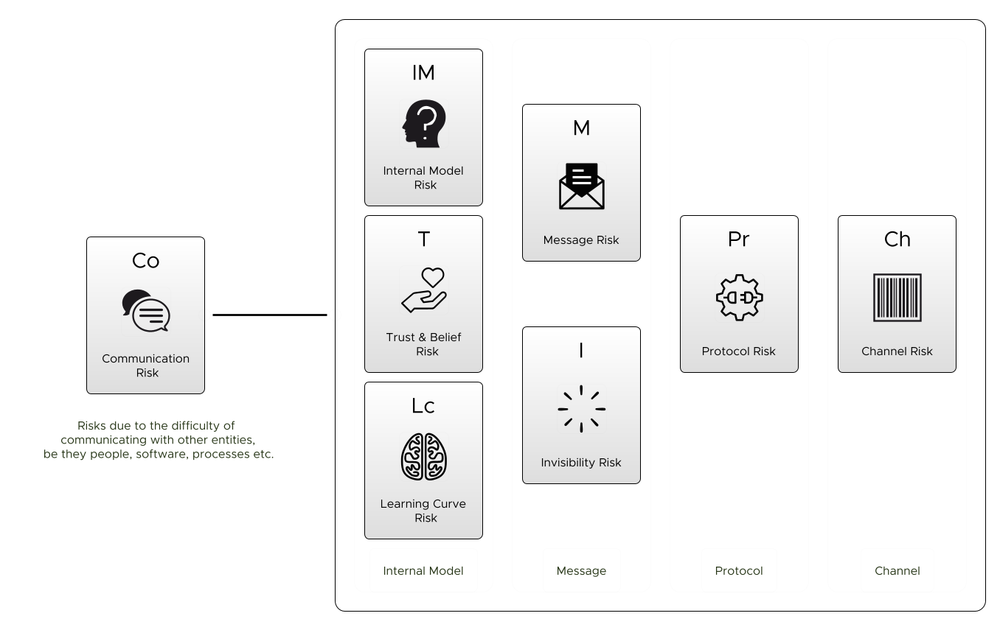

# Communication Risk

If we all had identical knowledge, there would be no need to do any communicating at all, and therefore no [Communication Risk](Communication-Risk.md).  

But people are not all-knowing oracles.  We rely on our _senses_ to improve our [Internal Models](../thinking/Glossary.md#Internal-Model) of the world. There is [Communication Risk](Communication-Risk.md) here - we might overlook something vital (like an on-coming truck) or mistake something someone says (like "Don't cut the green wire").  

## A Model Of Communication


In 1948, Claude Shannon proposed this definition of communication:

> "The fundamental problem of communication is that of reproducing at one point, either exactly or approximately, a message selected at another point." - [A Mathematical Theory Of Communication, _Claude Shannon_](https://en.wikipedia.org/wiki/A_Mathematical_Theory_of_Communication)  

And from this same paper we get the diagram above:  we move from top-left ("I want to send a message to someone"), clockwise to bottom left where we hope the message has been understood and believed.  (I've added this last box to Shannon's original diagram.)

One of the chief concerns in Shannon's paper is the risk of error between **Transmission** and **Reception**.  He creates a theory of _information_ (measured in _bits_), sets the upper-bounds of information that can be communicated over a channel, and describes ways in which [Communication Risk](Communication-Risk.md) between these processes can be mitigated by clever **Encoding** and **Decoding** steps.

But it's not just transmission.  [Communication Risk](Communication-Risk.md) exists at each of these steps.  Let's imagine a human example, where someone, **Alice** is trying to send a simple message to **Bob**.

|Step                  |Potential Risk                                           |
|----------------------|---------------------------------------------------------|
|Motivation            | **Alice** might be **motivated** to send a message to tell **Bob** something, only to find out that _he already knew it_. |
|Composition           | **Alice** might mess up the _intent_ of the message: instead of "Please buy chips" she might say, "Please buy chops". |
|Encoding              | **Alice** might not speak clearly enough to be understood. |
|Transmission          | **Alice** might not say it _loudly_ enough for **Bob** to hear. | 
|Reception             | **Bob** doesn't hear the message clearly (maybe there is background noise). |
|Decoding              | **Bob** might not decode what was said into a meaningful sentence. |
|Interpretation        | Assuming **Bob** _has_ heard, will he correctly **interpret**  which type of chips (or chops) **Alice** was talking about? |
|Reconciliation        | Does **Bob** believe the message?  Will he **reconcile** the information into his [Internal Model](../thinking/Glossary.md#Internal-Model) and act on it?  Perhaps not, if **Bob** thinks that there are chips at home already.|

## Approach To Communication Risk

There is a symmetry about the steps going on in the diagram above, and we're going to exploit this in order to break down [Communication Risk](Communication-Risk.md) into its main types.  <!-- tweet-end -->



To get inside [Communication Risk](Communication-Risk.md), we need to understand **Communication** itself, whether between _machines_, _people_ or _products_:   we'll look at each in turn.  In order to do that, we're going to examine four basic concepts in each of these settings:
 
 - **[Channels](https://en.wikipedia.org/wiki/Communication_channel)**: the medium via which the communication is happening.
 - **[Protocols](https://en.wikipedia.org/wiki/Communication_protocol)**:  the systems of rules that allow two or more entities of a communications system to transmit information.
 - **[Messages](https://en.wikipedia.org/wiki/Message)**: the information we want to convey.
 - **[Internal Models](../thinking/Glossary.md#Internal-Model)**: the sources and destinations for the messages.  Updating internal models (whether in our heads or machines) is the reason why we're communicating.
 
And, as we look at these four areas, we'll consider the [Attendant Risks](../thinking/Glossary.md#attendant-risk) of each.

## Channels

There are lots of different types of media for communicating (e.g. TV, Radio, DVD, Talking, Posters, Books, Phones, The Internet, etc. ) and they all have different characteristics.  When we communicate via a given medium, it's called a *channel*.  

The channel _characteristics_ depend on the medium then.  Some obvious ones are cost, utilisation, number of people reached, simplex or duplex (parties can transmit and receive at the same time), persistence (a play vs a book, say), latency (how long messages take to arrive) and bandwidth (the amount of information that can be transmitted in a period of time).

Channel characteristics are important:  in a high-bandwidth, low-latency situation, **Alice** and **Bob** can _check_ with each other that the meaning was transferred correctly.  They can discuss what to buy, they can agree that **Alice** wasn't lying or playing a joke.  

The channel characteristics also imply suitability for certain _kinds_ of messages.  A documentary might be a great way of explaining some economic concept, whereas an opera might not be.  <!-- tweet-end -->

## Channel Risk

Shannon discusses that no channel is perfect:  there is always the **risk of noise** corrupting the signal.  A key outcome from Shannon's paper is that there is a tradeoff:  within the capacity of the channel (the **Bandwidth**), you can either send lots of information with _higher_ risk that it is wrong, or less information with _lower_ risk of errors.

 

But channel risk goes wider than just this mathematical example:  messages might be delayed or delivered in the wrong order, or not be acknowledged when they do arrive.  Sometimes, a channel is just an inappropriate way of communicating.  When you work in a different time-zone to someone else on your team, there is _automatic_ [Channel Risk](Communication-Risk.md#channel-risk), because instantaneous communication is only available for a few hours a day. 

When channels are **poor-quality**, less communication occurs.  People will try to communicate just the most important information.  But, it's often impossible to know a-priori what constitutes "important".   This is why [Extreme Programming](https://en.wikipedia.org/wiki/Extreme_programming) recommends the practice of [Pair Programming](https://en.wikipedia.org/wiki/Pair_programming) and siting all the developers together: although you don't know whether useful communication will happen, you are mitigating [Channel Risk](Communication-Risk.md#channel-risk) by ensuring high-quality communication channels are in place.

At other times, channels are crowded, and can contain so much information that we can't hope to receive all the messages.  In these cases, we don't even observe the whole channel, just parts of it. 

#### Marketing Communications

When we are talking about a product or a brand, mitigating [Channel Risk](Communication-Risk.md#channel-risk) is the domain of [Marketing Communications](https://en.wikipedia.org/wiki/Marketing_communications).  <!-- tweet-end --> How do you ensure that the information about your (useful) project makes it to the right people?  How do you address the right channels? 

This works both ways.  Let's looks at some of the **Channel Risks** from the point of view of a hypothetical software tool, **D**, which would really useful in my software: 

 - The concept that there is such a thing as **D** which solves my problem isn't something I'd even considered.
 - I'd like to use something like **D**, but how do I find it?
 - There are multiple implementations of **D**, which is the best one for the task?
 - I know **D**, but I can't figure out how to solve my problem in it.
 - I've chosen **D**, I now need to persuade my team that **D** is the correct solution...
 - ... and then they also need to understand **D** to do their job too.


[Internal Models](../thinking/Glossary.md#Internal-Model) don't magically get populated with the information they need:  they fill up gradually, as shown in the diagram above.  Popular products and ideas _spread_, by word-of-mouth or other means.  Part of the job of being a good technologist is to keep track of new **Ideas**, **Concepts** and **Options**, so as to use them as [Dependencies](Dependency-Risk.md) when needed.

## Protocols

> "A communication protocol is a system of rules that allow two or more entities of a communications system to transmit information. " - [Communication Protocol, Wikipedia](https://en.wikipedia.org/wiki/Communication_protocol)

In this section I want to examine the concept of [Communication Protocols](https://en.wikipedia.org/wiki/Communication_protocol) and how they relate to [Abstraction](../thinking/Glossary.md#abstraction), which is implicated over and over again in different types of risk we will be looking at. 

[Abstraction](../thinking/Glossary.md#abstraction) means separating the _definition_ of something from the _use_ of something.  It's a widely applicable concept, but our example below will be specific to communication, and looking at the abstractions involved in loading a web page. 

First we need to broaden our terminology.  Although so far we've talked about **Senders** and **Receivers**, we now need to talk from the point of view of who-depends-on-who.  That is, Clients and Suppliers.

 - If you're _depended on_, then you're a **"Supplier"** (or a **"Server"**, when we're talking about actual hardware).
 - If you require communication with something else, you're a **"Client"**.   

 
 
In order that a web browser (a **client**) can load a web-page from a **server**, they both need to communicate with shared protocols.  In this example, this is going to involve (at least) six separate protocols, as shown in the diagram above.  

Let's examine each protocol in turn when I try to load the web page at the following address using a web browser:

```bash
http://google.com/preferences
```

### 1. DNS - Domain Name System

The first thing that happens is that the name `google.com` is _resolved_ by DNS.  This means that the browser looks up the domain name `google.com` and gets back an IP address.  

This is some [Abstraction](../thinking/Glossary.md#abstraction):  instead of using the machine's [IP Address](https://en.wikipedia.org/wiki/IP_address) on the network, `216.58.204.78`, I can use a human-readable address, `google.com`.   

The address `google.com` doesn't necessarily resolve to that same address each time:  _They have multiple IP addresses for `google.com`_, but as a user, I don't have to worry about this detail.

### 2. IP - Internet Protocol

But this hints at what is beneath the abstraction:  although I'm loading a web-page, the communication to the server happens by [IP Protocol](https://en.wikipedia.org/wiki/Internet_Protocol) - it's a bunch of discrete "packets" (streams of binary digits).  You can think of a packet as being like a real-world parcel or letter.

Each packet consists of two things: 
 
- An **IP Address**, which tells the network components (such as routers and gateways) where to send the packet, much like you'd write the address on the outside of a parcel.
- The **Payload**, the stream of bytes for processing at the destination, like the contents of the parcel.

But even this concept of "packets" is an [Abstraction](../thinking/Glossary.md#abstraction).  Although all the components of the network understand this protocol, we might be using Wired Ethernet cables, or WiFi, 4G or _something else_ beneath that.

### 3. 802.11 - WiFi Protocol

I ran this at home using WiFi, which uses [IEEE 802.11 Protocol](https://en.wikipedia.org/wiki/IEEE_802.11), which is another standard abstraction allowing my laptop to communicate with the router wirelessly.  But even _this_ isn't the bottom, because this is likely using [MIMO-OFDM](https://en.wikipedia.org/wiki/MIMO-OFDM), a specification about frequencies of microwave radiation, antennas, multiplexing, error-correction codes and so on.  

And WiFi is just the first hop.  After the WiFi receiver, there will be protocols for delivering the packets via the telephony system.

### 4. TCP - Transmission Control Protocol

Another [Abstraction](../thinking/Glossary.md#abstraction) going on here is that my browser believes it has a  "connection" to the server.  This is provided by the TCP protocol. 

But this is a fiction - my "connection" is built on the IP protocol, which as we saw above is just packets of data on the network.  So there are lots of packets floating around which say "this connection is still alive" and "I'm message 5 in the sequence" and so on in order to maintain this fiction.  

This all means that the browser can forget about all the details of packet ordering and work with the fictional abstraction of a connection.

### 5. HTTP - Hypertext Transfer Protocol

If we examine what is being sent on the TCP connection, we see something like this:

```bash
 > GET /preferences HTTP/1.1     
 > Host: google.com              
 > Accept: */*                   
 >
```

This is now the HTTP protocol proper, and these 4 lines are sending information _over the connection_ to the `google.com` server, to ask it for the page.  Finally, the server gets to respond:

```bash
 < HTTP/1.1 301 Moved Permanently                                      
 < Location: http://www.google.com/preferences
... 
```

In this case, the server is telling us that the web page has changed address.    The `301` is a status code meaning the page has moved:  instead of `http://google.com/preferences`, we want `http://www.google.com/preferences`.

### Summary

By having a stack of protocols we are able to apply [Separation Of Concerns](https://en.wikipedia.org/wiki/Separation_of_concerns), each protocol handling just a few concerns<!-- tweet-end -->:

|Protocol              |Abstractions                                     |
|----------------------|-------------------------------------------------|
|`HTTP`                |URLs, error codes, pages.                        |
|`DNS`                 |Names of servers to IP Addresses.                |
|`TCP`                 |The concept of a "connection" with guarantees about ordering and delivery.|
|`IP`                  |"Packets" with addresses and payloads.           |
|`WiFi`                |"Networks", 802.11 flavours, Transmitters, Antennas, error correction codes.| 

`HTTP` "stands on the shoulders of giants":  not only does it get to use pre-existing protocols like `TCP` and `DNS` to make its life easier, it got `WiFi` "for free" when this came along and plugged into the existing `IP` protocol.<!-- tweet-end -->  This is the key value of abstraction:  you get to piggy-back on _existing_ patterns, and use them yourself. 

## Protocol Risk



Hopefully, the above example gives an indication of the usefulness of protocols within software.  But for every protocol we use, we have [Protocol Risk](Communication-Risk.md#protocol-risk).  While this is a problem in human communication protocols, it's really common in computer communication because we create protocols _all the time_ in software. 

For example, as soon as we define a Javascript function (called **b** here), we are creating a protocol for other functions (**a** here) to use it: 

```javascript
function b(a, b, c) {
    return a+b+c;
}

function a() {
	var bOut = b(1,2,3);
	return "something "+bOut;		// returns "something 6"
}
```

If function **b** then changes, say:

```javascript
function b(a, b, c, d /* new parameter */) {
    return a+b+c+d;
}
```

Then, **a** will instantly have a problem calling it and there will be an error of some sort.

[Protocol Risk](Communication-Risk.md#protocol-risk) also occurs when we use [Data Types](https://en.wikipedia.org/wiki/Data_type):  whenever we change the data type, we need to correct the usages of that type.  Note above, I've given the `JavaScript` example, but I'm going to switch to `TypeScript` now:

```javascript
interface BInput {
    a: string,
    b: string, 
    c: string,
    d: string
}

function b(in: BInput): string {
    return in.a + in.b + in.c + in.d; 
}

function a() {
	var bOut = b({a: 1, b: 2, c: 3); // new parameter d missing
	return "something "+bOut;		
}
```

By using a [static type checker](https://en.wikipedia.org/wiki/Type_system#Static_type_checking), we can identify issues like this, but there is a trade-off:  we mitigate [Protocol Risk](Communication-Risk.md#protocol-risk), because we define the protocols _once only_ in the program, and ensure that usages all match the specification.  But the tradeoff is (as we can see in the TypeScript code) more _finger-typing_, which means [Codebase Risk](Complexity-Risk.md#codebase-risk) in some circumstances. 

Nevertheless, static type checking is so prevalent in software that clearly in most cases, the trade-off has been worth it: even languages like [Clojure](https://clojure.org) have been retro-fitted with [type checkers](http://clojure-doc.org/articles/ecosystem/core_typed/home.html).

Let's look at some further types of [Protocol Risk](Communication-Risk.md#protocol-risk).
 
### Protocol Incompatibility Risk

The people you find it _easiest_ to communicate with are your friends and family, those closest to you. <!-- tweet-end --> That's because you're all familiar with the same protocols.  Someone from a foreign country, speaking a different language and having a different culture, will essentially have a completely incompatible protocol for spoken communication to you.

Within software there are also competing, incompatible protocols for the same things, which is maddening when your protocol isn't supported.   For example, although the world seems to be standardising, there used to be _hundreds_ of different image formats.  Photographs often use [TIFF](https://en.wikipedia.org/wiki/TIFF), [RAW](https://en.wikipedia.org/wiki/Raw_image_format) or [JPEG](https://en.wikipedia.org/wiki/JPEG), whilst we also have [SVG](https://en.wikipedia.org/wiki/Scalable_Vector_Graphics) for vector graphics, [GIF](https://en.wikipedia.org/wiki/GIF) for images and animations and [PNG](https://en.wikipedia.org/wiki/Portable_Network_Graphics) for other bitmap graphics.   

### Protocol Versioning Risk

Even when systems are talking the same protocol there can be problems. <!-- tweet-end --> When we have multiple, different systems owned by different parties, on their own upgrade cycles, we have **Protocol Versioning Risk**: the risk that either client or supplier could start talking in a version of the protocol that the other side hasn't learnt yet.  There are various mitigating strategies for this.  We'll look at two now: **Backwards Compatibility** and **Forwards Compatibility**.

#### Backward Compatibility

Backwards Compatibility mitigates [Protocol Versioning Risk](Communication-Risk.md#protocol-versioning-risk).  This means supporting the old protocol until it falls out of use.  If a supplier is pushing for a change in protocol it either must ensure that it is Backwards Compatible with the clients it is communicating with, or make sure they are upgraded concurrently.  When building [web services](https://en.wikipedia.org/wiki/Web_service), for example, it's common practice to version all API's so that you can manage the migration.  Something like this:

 - Supplier publishes `/api/v1/something`.
 - Clients use `/api/v1/something`.
 - Supplier publishes `/api/v2/something`.
 - Clients start using `/api/v2/something`.
 - Clients (eventually) stop using `/api/v1/something`.
 - Supplier retires `/api/v1/something` API. 

#### Forward Compatibility

`HTML` and `HTTP` provide "graceful failure" to mitigate [Protocol Risk](Communication-Risk.md#protocol-risk)<!-- tweet-end -->:  while it's expected that all clients can parse the syntax of `HTML` and `HTTP`, it's not necessary for them to be able to handle all of the tags, attributes and rules they see.  The specification for both these standards is that if you don't understand something, ignore it.  Designing with this in mind means that old clients can always at least cope with new features, but it's not always possible.  

`JavaScript` _can't_ support this:  because the meaning of the next instruction will often depend on the result of the previous one.  

Do human languages support this?  To some extent!  New words are added to our languages all the time.  When we come across a new word, we can either ignore it, guess the meaning, ask or look it up.  In this way, human language has **Forward Compatibility** features built in.

### Protocol Implementation Risk

A second aspect of [Protocol Risk](Communication-Risk.md#protocol-risk) exists in heterogeneous computing environments where protocols have been independently implemented based on standards.  For example, there are now so many different browsers, all supporting variations of `HTTP`, `HTML` and `JavaScript` that it becomes impossible to test comprehensively over all the different versions.  To mitigate as much [Protocol Risk](Communication-Risk.md#protocol-risk) as possible, generally we test web sites in a subset of browsers, and use a lowest-common-denominator approach to choosing protocol and language features.

## Messages

 

Although Shannon's Communication Theory is about transmitting **Messages**, messages are really encoded **Ideas** and **Concepts**, from an **Internal Model**. <!-- tweet-end -->  Let's break down some of the risks associated with this:

### Internal Model Risk

When we construct messages in a conversation, we have to make judgements about what the other person already knows.  For example, if I talk to you about a new [JDBC Driver](https://en.wikipedia.org/wiki/JDBC_driver), this presumes that you know what JDBC is.  The message has a dependency on prior knowledge.  Or, when talking to children it's often hard work because they _assume_ that you have knowledge of everything they do.  

This is called [Theory Of Mind](https://en.wikipedia.org/wiki/Theory_of_mind): the appreciation that your knowledge is different to other people's, and adjusting you messages accordingly.  When teaching, this is called [The Curse Of Knowledge](https://en.wikipedia.org/wiki/Curse_of_knowledge):  teachers have difficulty understanding students' problems _because they already understand the subject_.  

### Message Risk  

A second, related problem is actually [Dependency Risk](Dependency-Risk.md), which is covered more thoroughly in a later section.  Often, to understand a new message, you have to have followed everything up to that point already.

The same **Message Dependency Risk** exists for computer software:  if there is replication going on between instances of an application and one of the instances misses some messages, you end up with a "[Split Brain](https://en.wikipedia.org/wiki/Split-brain_(computing))" scenario, where later messages can't be processed because they refer to an application state that doesn't exist.  For example, a message saying:

```
Update user 53's surname to 'Jones'
```

only makes sense if the application has previously processed the message 

```
Create user 53 with surname 'Smith'
```

### Misinterpretation Risk

For people, nothing exists unless we have a name for it. <!-- tweet-end --> The world is just atoms, but we don't think like this.  _The name is the thing_.  

> "The famous pipe. How people reproached me for it! And yet, could you stuff my pipe? No, it's just a representation, is it not? So if I had written on my picture “This is a pipe”, I'd have been lying!" - [Rene Magritte, of _The Treachery of Images_](https://en.wikipedia.org/wiki/The_Treachery_of_Images)

People don't rely on rigorous definitions of abstractions like computers do; we make do with fuzzy definitions of concepts and ideas.  We rely on [Abstraction](../thinking/Glossary.md#abstraction) to move between the name of a thing and the _idea of a thing_.

This brings about [Misinterpretation Risk](Communication-Risk.md#misinterpretation-risk): names are not _precise_, and concepts mean different things to different people.  We can't be sure that other people have the same meaning for a name that we have.  

### Invisibility Risk
 
Another cost of [Abstraction](../thinking/Glossary.md#abstraction) is [Invisibility Risk](Communication-Risk.md#invisibility-risk).  While abstraction is a massively powerful technique, (as we saw above, [Protocols](Communication-Risk.md#protocols) allow things like the Internet to happen) it lets the function of a thing hide behind the layers of abstraction and become invisible.  

#### Invisibility Risk In Conversation

[Invisibility Risk](Communication-Risk.md#invisibility-risk) is risk due to information not sent.  Because humans don't need a complete understanding of a concept to use it, we can cope with some [Invisibility Risk](Communication-Risk.md#invisibility-risk) in communication and this saves us time when we're talking.   It would be _painful_ to have conversations if, say, the other person needed to understand everything about how cars worked in order to discuss cars.  

For people, [Abstraction](../thinking/Glossary.md#abstraction) is a tool that we can use to refer to other concepts, without necessarily knowing how the concepts work. <!-- tweet-end --> This divorcing of "what" from "how" is the essence of abstraction and is what makes language useful.   

The debt of [Invisibility Risk](Communication-Risk.md#invisibility-risk) comes due when you realise that _not_ being given the details _prevents_ you from reasoning about it effectively.<!-- tweet-end -->  Let's think about this in the context of a project status meeting, for example:
 
- Can you be sure that the status update contains all the details you need to know?
- Is the person giving the update wrong or lying?
- Do you know enough about the details of what's being discussed in order to make informed decisions about how the project is going?

#### Invisibility Risk In Software

Invisibility Risk is everywhere in software.  Let's consider what happens when, in your program, you create a new function, **f**:

 - First, by creating **f**, you have _given a piece of functionality a name_, which is abstraction.
 - Second, **f** _supplies_ functionality to clients, so we have created a client-supplier relationship.
 - Third, these parties now need to communicate, and this will require a protocol.  In a programming language, this protocol dictates the arguments passed to **f** and the response _back_ from **f**. 
 
But something else also happens:  by creating **f**, you are saying “I have this operation, the details of which I won’t mention again, but from now on it’s called **f**”  Suddenly, the implementation of “**f**” hides and it is working invisibly.  Things go on in **f** that people don’t necessarily understand.  

_Referring to **f** is a much simpler job than understanding **f**._

We try to mitigate this via documentation but this is a terrible deal:  documentation is necessarily a simplified explanation of the abstraction, so will still suffer from [Invisibility Risk](Communication-Risk.md#invisibility-risk).

[Invisibility Risk](Communication-Risk.md#invisibility-risk) is mainly [Hidden Risk](../thinking/Glossary.md#Hidden-Risk).  (Mostly, _you don't know what you don't know_.)  But you can carelessly _hide things from yourself_ with software<!-- tweet-end -->:

 - Adding a thread to an application that doesn't report whether it worked, failed, or is running out of control and consuming all the cycles of the CPU.
 - Redundancy can increase reliability, but only if you know when servers fail, and fix them quickly.   Otherwise, you only see problems when the last server fails.
 - When building a web-service, can you assume that it's working for the users in the way you want it to?

When you build a software service, or even implement a thread, ask yourself:  "How will I know next week that this is working properly?"  <!-- tweet-end -->If the answer involves manual work and investigation, then your implementation has just cost you in [Invisibility Risk](Communication-Risk.md#invisibility-risk).

## Internal Models



The communication process so far has been fraught with risks, but now let's look at risks specific to our internal models.

### Trust & Belief Risk

Although protocols can sometimes handle security features of communication (such as [Authentication](https://en.wikipedia.org/wiki/Authentication) and preventing [man-in-the-middle attacks](https://en.wikipedia.org/wiki/Man-in-the-middle_attack)), trust goes further than this, it is the flip-side of [Agency Risk](Agency-Risk.md), which we will look at later:  can you be sure that the other party in the communication is acting in your best interests?
 
Even if the receiver trusts the communicator, they may not believe the message.  Let's look at some reasons for that:

- **[Weltanschauung (World View)](https://en.wikipedia.org/wiki/World_view)**: the ethics, values and beliefs in the receiver's [Internal Model](../thinking/Glossary.md#Internal-Model) may be incompatible to those from the sender.
- **[Relativism](https://en.wikipedia.org/wiki/Relativism)** is the concept that there are no universal truths.  Every truth is from a frame of reference.  For example, what constitutes _offensive language_ is dependent on the listener.
- **[Psycholinguistics](https://en.wikipedia.org/wiki/Psycholinguistics)** is the study of how humans acquire languages.  There are different languages, dialects, and _industry dialects_.  We all understand language in different ways, take different meanings and apply different contexts to the messages.
  
From the point-of-view of [Marketing Communications](Communication-Risk.md#Marketing-Communications), choosing the right message is part of the battle.  You are trying to communicate your idea in such a way as to mitigate Trust & Belief Risk.

### Learning Curve Risk

If the messages we are receiving force us to update our [Internal Model](../thinking/Glossary.md#Internal-Model) too much, we can suffer from the problem of "too steep a [Learning Curve](https://en.wikipedia.org/wiki/Learning_curve)" or "[Information Overload](https://en.wikipedia.org/wiki/Information_overload)", where the messages force us to adapt our [Internal Model](../thinking/Glossary.md#Internal-Model) too quickly for our brains to keep up.  

Commonly, the easiest option is just to ignore the information channel completely in these cases.

### Reading Code

It has often been said that code is _harder to read than to write_:  

> "If you ask a software developer what they spend their time doing, they'll tell you that they spend most of their time writing code.  However, if you actually observe what software developers spend their time doing, you'll find that they spend most of their time trying to understand code. " -  [When Understanding Means Rewriting, _Coding Horror_](https://blog.codinghorror.com/when-understanding-means-rewriting/)

By now it should be clear that it's going to be _both_ quite hard to read and write:  the protocol of code is actually designed for the purpose of machines communicating, not primarily for people to understand.  Making code human readable is a secondary concern to making it machine readable.

But now we should be able to see the reason why it's harder to read than write too: 
 
 - When reading code, you are having to shift your [Internal Model](../thinking/Glossary.md#Internal-Model) to wherever the code is, accepting decisions that you might not agree with and accepting counter-intuitive logical leaps.  i.e. [Learning Curve Risk](Communication-Risk.md#learning-curve-risk). _(cf. [Principle of Least Surprise](https://en.wikipedia.org/wiki/Principle_of_least_astonishment))_
 - There is no [Feedback Loop](../thinking/Glossary.md#Feedback-Loop) between your [Internal Model](../thinking/Glossary.md#Internal-Model) and the [Reality](../thinking/Glossary.md#Meet-Reality) of the code, opening you up to [Misinterpretation Risk](Communication-Risk.md#misinterpretation-risk).  When you write code, your compiler and tests give you this.
 - While reading code _takes less time_ than writing it, this also means the [Learning Curve](Communication-Risk.md#learning-curve-risk) is steeper.

## Communication Risk Wrap Up



In this section, we've looked at [Communication Risk](Communication-Risk.md) itself and broken it down into six sub-types of risk as shown in the diagram above.  Again, we are calling out _patterns_ here. You could classify communication risks in other ways, but concepts like [Learning Curve Risk](#Learning-Curve-Risk) and [Invisibility Risk](#Invisibility-Risk) we will be using again in again in Risk-First.

In the next section we will address complexity head-on and understand how [Complexity Risk](Complexity-Risk.md) manifests in software projects.
