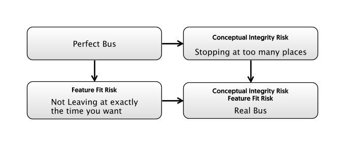
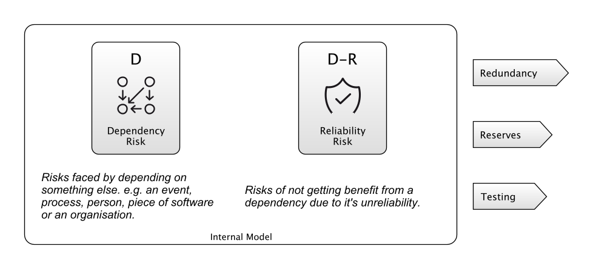

# Dependency Risk

[Dependency Risk](Dependency-Risk.md) is the risk you take on whenever you have a dependency on something (or someone) else.   <!-- tweet-end -->

One simple example could be that the software service you write might depend on hardware to run on:  if the server goes down, the service goes down too.  In turn, the server depends on electricity from a supplier, as well as a network connection from a provider.  If either of these dependencies aren't met, the service is out of commission.

Dependencies can be on _events_, _people_, _teams_, _work_, _processes_, _software_, _services_, _money_ and pretty much _any resource_, and while every project will need some of these, they also _add risk_ to any project because the reliability of the project itself is now a function involving the reliability of the dependency.  

In order to avoid repetition, and also to break down this large topic, we're going to look at this over 7 sections:   

 - This first section will look at dependencies _in general_, and some of the variations of [Dependency Risk](Dependency-Risk.md).
 - Next, we'll look at [Scarcity Risk](Scarcity-Risk.md), because time, money and staff are scarce resources in every project.
 - We'll cover [Deadline Risk](Deadline-Risk.md), and discuss the purpose of Events and Deadlines, and how they enable us to coordinate around dependency use.
 - Then, we'll move on to look specifically at [Software Dependency Risk](Software-Dependency-Risk.md), covering using libraries, software services and building on top of the work of others.
 - Then, we'll take a look at [Process Risk](Process-Risk.md), which is still [Dependency Risk](Dependency-Risk.md), but we'll be considering more organisational factors and how bureaucracy comes into the picture.
 - After that, we'll take a closer look at [Boundary Risk](Boundary-Risk.md) and [Dead-End Risk](Complexity-Risk.md#dead-end-risk).  These are the risks you face in making choices about what to depend on.
 - Finally, we'll wrap up this analysis with a look at some of the specific problems around depending on other people or businesses in [Agency Risk](Agency-Risk.md).
  
## Why Have Dependencies?

Luckily for us, the things we depend on in life are, for the most part, abundant:  water to drink, air to breathe, light, heat and most of the time, food for energy.  

This isn't even lucky though: life has adapted to build dependencies on things that it can _rely_ on.  

Although life exists at the bottom of the ocean around [hydrothermal vents](https://en.wikipedia.org/wiki/Hydrothermal_vent), it is a very different kind of life to ours and has a different set of dependencies given its circumstances. 

This tells us a lot about [Dependency Risk](Dependency-Risk.md) right here:

 - On the one hand, _depending on something_ is very often helpful, and quite often essential.  (For example, all life seem to depend on water).
 - Successful organisms _adapt_ to the dependencies available to them (like the thermal vent creatures).
 - However, as soon as you have dependencies, you need to take into account their _reliability_. (Living near a river or stream gives you access to fresh water, for example).
So, dependencies are a trade-off.  They give with one hand and take with the other.  Our modern lives are full of dependency (just think of the chains of dependency needed for putting a packet of biscuits on a supermarket shelf, for example), but we accept this risk because it makes life _easier_. 
 - There is likely to be _competition_ for a dependency when it is scarce (think of droughts and famine).

Let's look at four types of risk that apply to every dependency:  Fit, Reliability, Invisibility and Complexity.

## Fit Risk

In order to illustrate some of the different [Dependency Risks](Dependency-Risk.md), let's introduce a running example:  trying to get to work each day.  There are probably a few alternative ways to make your journey each day, such as _by car_, _walking_ or _by bus_.  These are all alternative dependencies but give you the same _feature_: they'll get you there.

Normally, we'll use the same dependency each day.  This speaks to the fact that each of these approaches has different [Feature Fit Risk](Feature-Risk.md#feature-fit-risk).   Perhaps you choose going by bus over going by car because of the risk that owning the car is expensive, or that you might not be able to find somewhere to park it.

But there are a couple of problems with buses you don't have with your own car, as shown in the above diagram. A bus might take you to lots of in-between places you _didn't_ want to go, which is [Conceptual Integrity Risk](Feature-Risk.md#conceptual-integrity-risk) and we saw this already in the section on [Feature Risk](Feature-Risk.md).  Also, it might not go at the time you want it to, which is [Feature-Fit-Risk](Feature-Risk.md#feature-fit-risk).  

What this shows us is that [Fit Risks](Feature-Risk.md#feature-fit-risk) are as much a problem for the suppliers of the dependency (the people running the bus service) as they are for the people (like you or I) _using_ the dependency.

## Reliability Risk

This points to the problem that when we use an external dependency, we are at the mercy of its reliability.   

> "... Reliability describes the ability of a system or component to function under stated conditions for a specified period of time." - [Reliability Engineering, _Wikipedia_](https://en.m.wikipedia.org/wiki/Reliability_engineering)

 

It's easy to think about reliability for something like a bus:  sometimes, it's late due to weather, or cancelled due to driver sickness, or the route changes unexpectedly due to road works.  

In software, it's no different:  _unreliability_ is the flip-side of [Feature Implementation Risk](Feature-Risk.md#implementation-risk).  It's caused in the gap between the real behaviour of the software and the expectations for it.

There is an upper bound on the reliability of the software you write, and this is based on the dependencies you use and (in turn) the reliability of those dependencies:
  
 - If a component **A** depends on component **B**, unless there is some extra redundancy around **B**, then **A** _can't_ be more reliable than **B**.
 - Is **A** or **B** a [Single Point Of Failure](https://en.wikipedia.org/wiki/Single_point_of_failure) in a system?
 - Are there bugs in **B** that are going to prevent it working correctly in all circumstances?

This kind of stuff is encapsulated in the science of [Reliability Engineering](https://en.wikipedia.org/wiki/Reliability_engineering).   For example, [Failure Mode and Effects Analysis (FEMA)](https://en.wikipedia.org/wiki/Failure_mode_and_effects_analysis):

> "...was one of the first highly structured, systematic techniques for failure analysis. It was developed by reliability engineers in the late 1950s to study problems that might arise from malfunctions of military systems. " - [FEMA, _Wikipedia_](https://en.wikipedia.org/wiki/Failure_mode_and_effects_analysis)

This was applied on NASA missions, and then in the 1970's to car design following the [Ford Pinto exploding car](https://en.wikipedia.org/wiki/Ford_Pinto#Design_flaws_and_ensuing_lawsuits) affair.  But establishing the reliability of software dependencies like this would be _hard_ and _expensive_.  We are more likely to mitigate [Reliability Risk](#reliability-risk) in software using _testing_, _redundancy_ and _reserves_, as shown in the diagram above.  

Additionally, we often rely on _proxies for reliability_.  We'll look at these proxies (and the way in which software projects signal their reliability) in much more detail in the section on [Software Dependency Risk](Software-Dependency-Risk.md).

## Invisibility Risk

Dependencies (like the bus) make life simpler for you by taking on complexity for you.

In software, dependencies are a way to manage [Complexity Risk](Complexity-Risk.md).  The reason for this is that a dependency gives you an [abstraction](../thinking/Glossary.md#abstraction): you no longer need to know _how_ to do something, (that's the job of the dependency), you just need to interact with the dependency properly to get the job done.  Buses are _perfect_ for people who can't drive, after all.

But (as shown in the above diagram) this means that all of the issues of abstractions that we covered in [Communication Risk](Communication-Risk.md) apply.  For example, there is [Invisibility Risk](Communication-Risk.md#invisibility-risk) because you probably don't have a full view of what the dependency is doing.  Nowadays, bus stops have a digital "arrivals" board which gives you details of when the bus will arrive, and shops publish their opening hours online.  But, abstraction always means the loss of detail (the bus might be two minutes away but could already be full).

## Dependencies And Complexity

In Rich Hickey's talk, [Simple Made Easy](https://www.infoq.com/presentations/Simple-Made-Easy) he discusses the difference between _simple_ software systems and _easy_ (to use) ones, heavily stressing the virtues of simple over easy.  It's an incredible talk and well worth watching.  

But: living systems are not simple.  Not anymore.  They evolved in the direction of increasing complexity because life was _easier_ that way.  In the "simpler" direction, life is first _harder_ and then _impossible_, and then an evolutionary dead-end.  

Depending on things makes _your job easier_.  But the [Complexity Risk](Complexity-Risk.md) hasn't gone away: it's just _transferred_ to the dependency.  It's just [division of labour](https://en.wikipedia.org/wiki/Division_of_labour) and dependency hierarchies, as we saw in [Complexity Risk](Complexity-Risk.md#Hierarchies-and-Modularisation).

Our economic system and our software systems exhibit the same tendency-towards-complexity.  For example, the television in my house now is _vastly more complicated_ than the one in my home when I was a child.  But, it contains much more functionality and consumes much less power and space.  

## Managing Dependency Risk

Arguably, managing [Dependency Risk](Dependency-Risk.md) is _what Project Managers do_.  Their job is to meet the project's [Goal](../thinking/Glossary.md#goal-in-mind) by organising the available dependencies into some kind of useful order.  

There are some tools for managing dependency risk:  [Gantt Charts](https://en.wikipedia.org/wiki/Gantt_chart) for example, arrange work according to the capacity of the resources (i.e. dependencies) available, but also the _dependencies between the tasks_.   If task **B** requires the outputs of task **A**, then clearly task **A** comes first and task **B** starts after it finishes.  We'll look at this more in [Process Risk](Process-Risk.md). 

We'll look in more detail at project management in Part 3, later.   But now, let's get into specifics with [Scarcity Risk](Scarcity-Risk.md).

