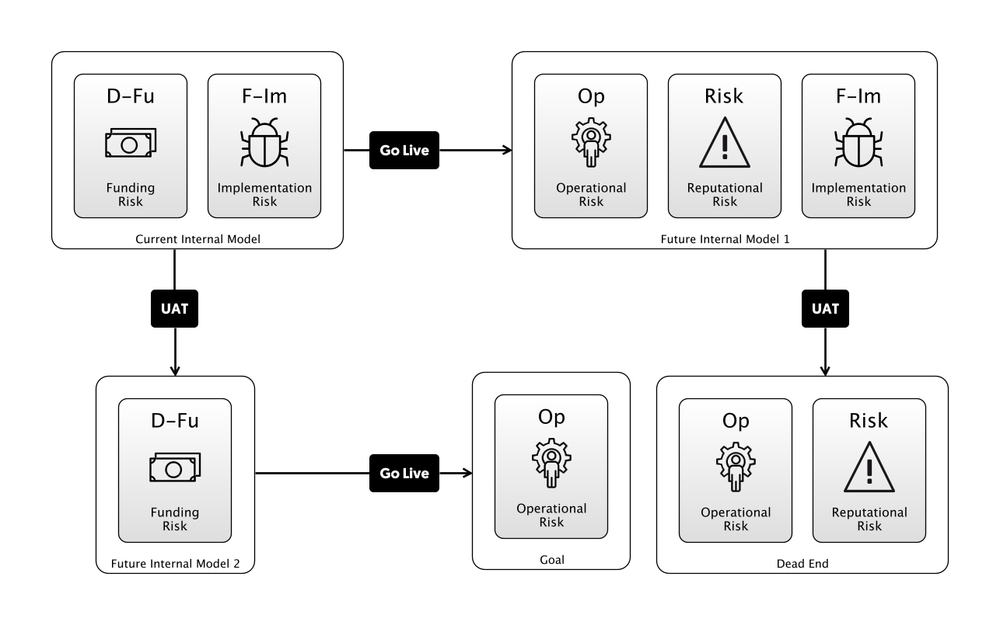

# Consider Payoff

How do you choose what to work on next?

Sometimes, there will be multiple actions you could take and you have to choose one: 

- There's the risk you'll decide wrongly.
- And, making a decision takes time, which could add risk to your schedule.
- And what's the risk if the decision doesn't get made?

Let's take a hypothetical example:  you're on a project and you're faced with the decision - release now or do more testing?  

Obviously, in the ideal world, we want to get to the place on the [Risk Landscape](../thinking/Glossary.md#risk-landscape) where we have a tested, bug-free system in production.  But we're not there yet, and we have funding pressure to get the software into the hands of some paying customers.  The table below shows an example: 

|Risk Managed          |Action               |Attendant Risk                           |Payoff             | 
|----------------------|---------------------|-----------------------------------------|-------------------|
|Funding Risk          |Go Live              |Reputational Risk, Operational Risk      |MEDIUM             |
|Implementation Risk   |User Acceptance Test |Worse Funding Risk, Operational Risk     |LOW                |

This is (a simplification of) the dilemma of lots of software projects - _test further_, to reduce the risk of users discovering bugs ([Implementation Risk](../risks/Feature-Risk.md#implementation-risk)) which would cause us reputational damage, or _get the release done_ and reduce our [Funding Risk](../risks/Scarcity-Risk.md#funding-risk) by getting paying clients sooner. 

In the above table, it _appears_ to be better to do the "Go Live" action, as there is a greater [Payoff](../thinking/Glossary.md#payoff).  The problem is, actions are not _commutative_, i.e. the order you do them in counts.

The diagram above shows our decision as _moves on the [Risk Landscape](../thinking/Glossary.md#risk-landscape)_.  Whether you "Go Live" first, or "UAT" first makes a difference to where you will end up.  Is there a further action you can take to get you from the "Dead End" to the "Goal"?  Perhaps.

## Failure

So, when we talk about a project "failing", what do we mean?  

Usually, we mean we've failed to achieve a goal, and since _goals are risks_, it is simply the scenario where we are overwhelmed by [Attendant Risks](../thinking/Glossary.md#attendant-risk): there is _no_ action to take that has a good-enough [Payoff](../thinking/Glossary.md#payoff) to get us out of our hole.   

## "Upside Risk"

"Upside Risk" isn't a commonly used term:  industry tends to prefer "value", as in "Is this a value-add project?".  There is plenty of theory surrounding **Value**, such as Porter's [Value Chain](https://en.wikipedia.org/wiki/Value_chain) and [Net Present Value](https://en.wikipedia.org/wiki/Net_present_value).  This is all fine so long as we remember:

 - **The probability of [Payoff](../thinking/Glossary.md#payoff) is risky**. Since the value is created in the future, we can't be certain about it happening - we should never consider it a done-deal.  **Future Value** is always at risk.  In finance, for example, we account for this in our future cash-flows by discounting them according to the risk of default.
 - **The Payoff amount is risky**.  Additionally, whereas in a financial transaction (like a loan, say), we might know the size of a future payment, in IT projects we can rarely be sure that they will deliver a certain return.  On some fixed-contract projects this sometimes is not true: there may be a date when the payment-for-delivery gets made, but mostly we'll be expecting an uncertain Payoff. 
 - Humans tend to be optimists (especially when there are lots of [Hidden Risks](../thinking/Glossary.md#hidden-risk)), hence our focus on Downside Risk.  Sometimes though, it's good to stand back and look at a scenario and think:  am I capturing all the Upside Risk here?
 
## What To Do?

As a concept, payoff is made more tricky because often the actions you take might depend on one another, and the payoff might not be immediate.  

So, first things first, you need to make sure you're [Tracking Risk](Track-Risk.md) properly.
