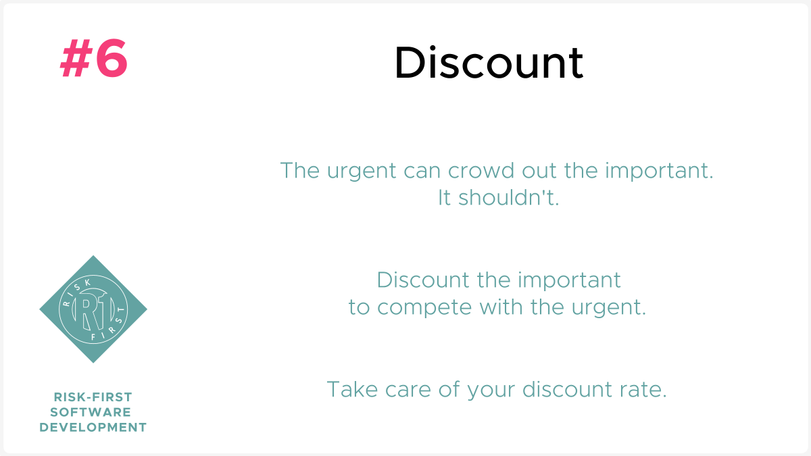
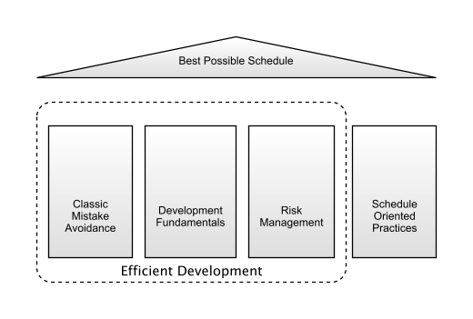
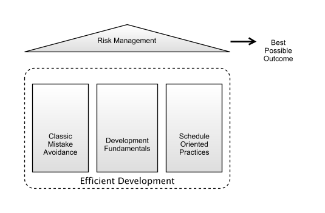
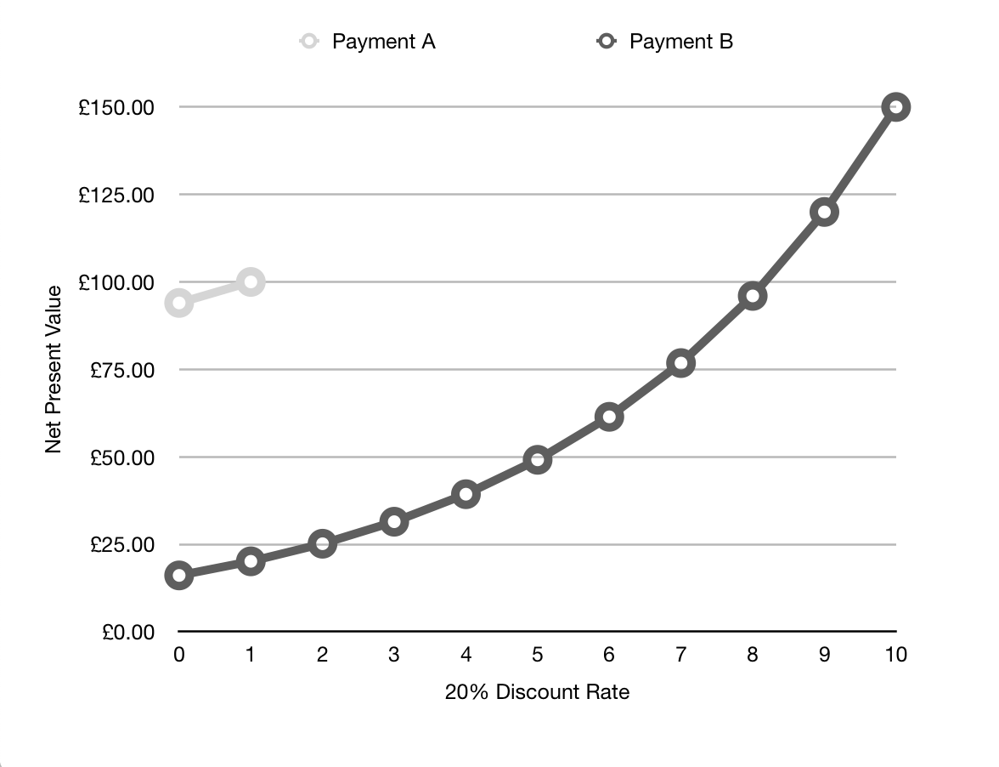
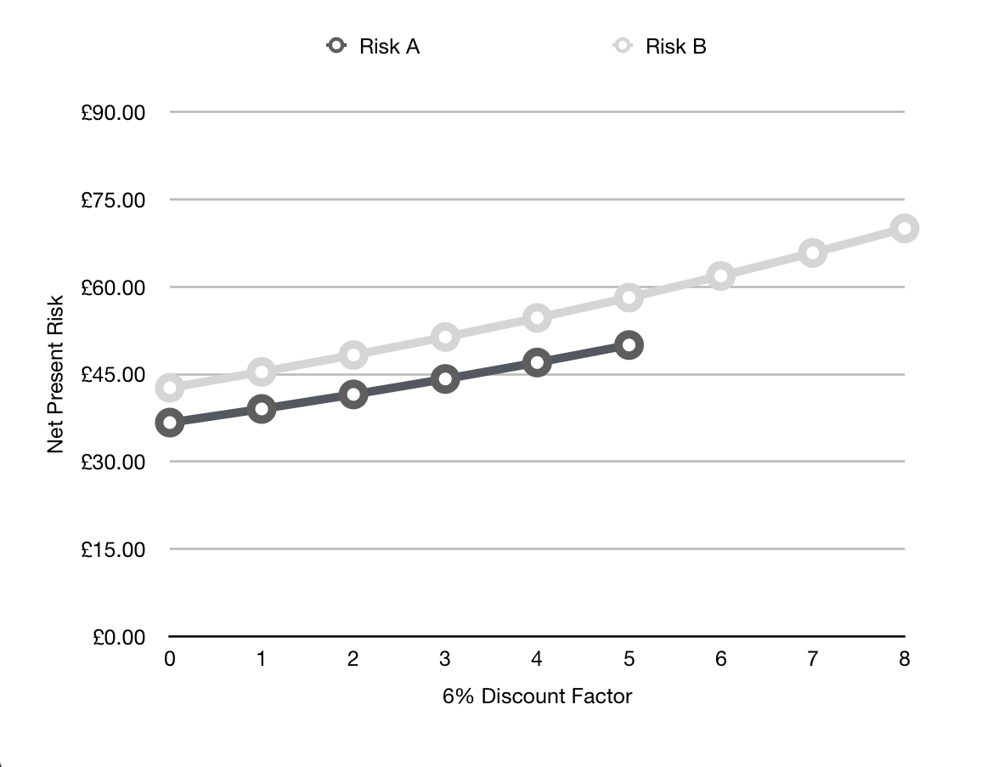
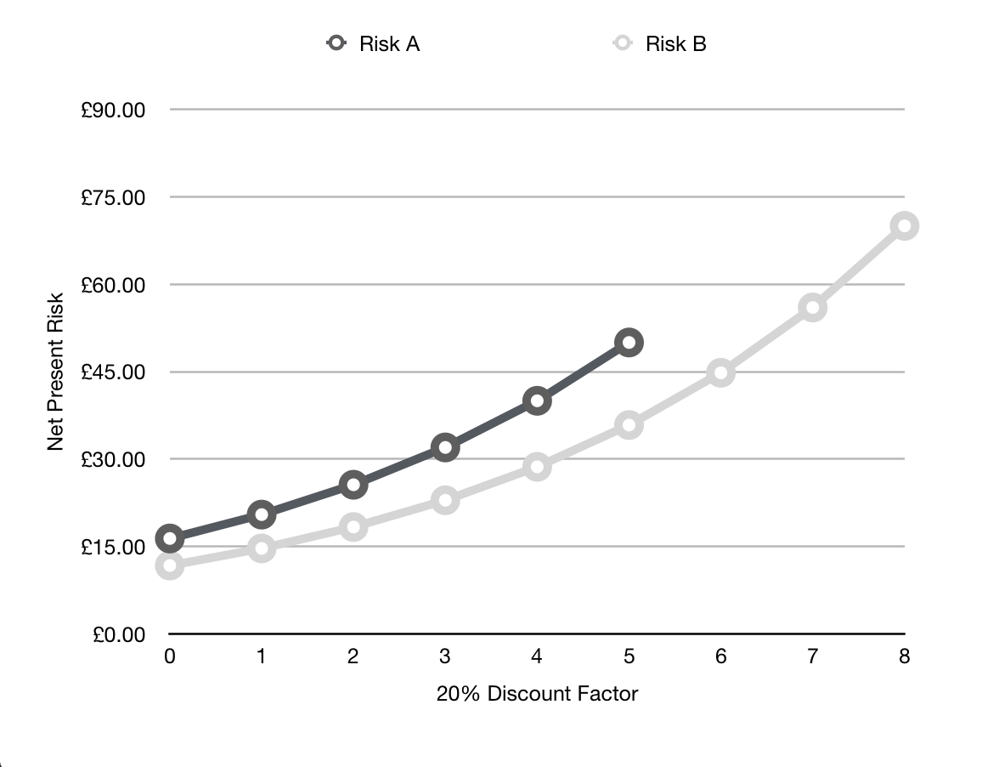
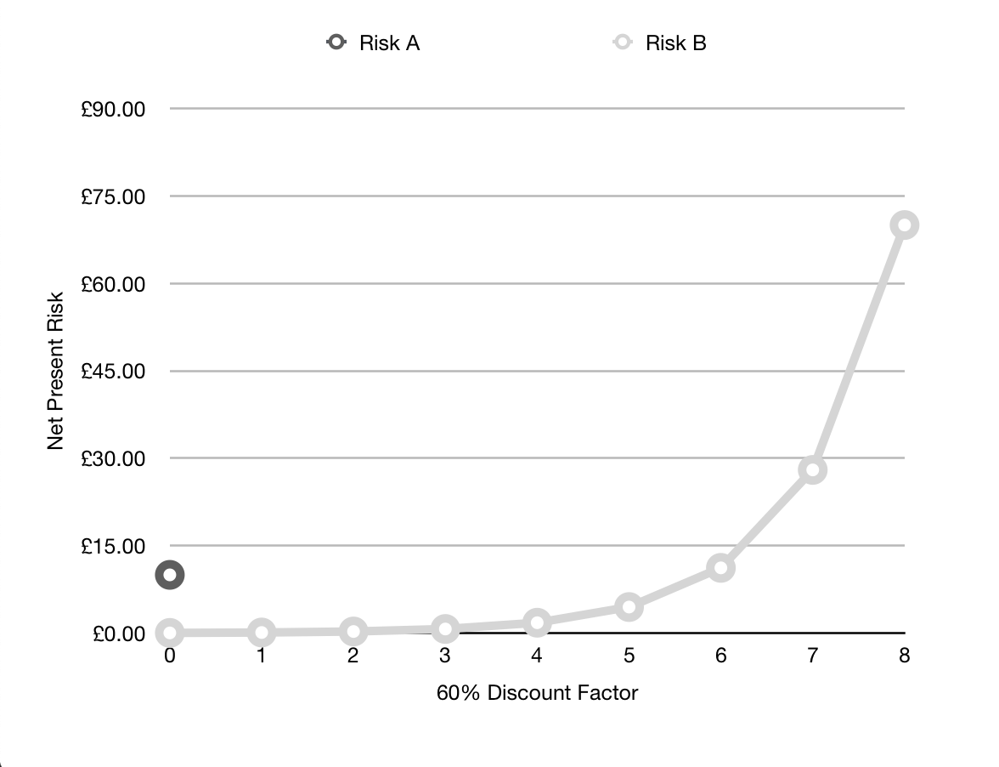

# Evaluating Risk

Let's look at some tools to help us decide when to do "urgent" work vs. when to do "important" work.

### Speed

  

The diagram above reproduces a figure from [Rapid Development](http://a.co/d/ddWGTB2) by Steve McConnell.  This is _fine_: McConnell is structuring the process from the perspective of _delivering as quickly as possible_.  However, here, I want to turn this on its head.  Software Development from a risk-perspective is an under-explored technique and I believe it offers some useful insights.   So the aim here is to present the case for viewing software development like this:

As we will see, _Speed_ (or [Schedule Risk](../risks/Scarcity-Risk.md#schedule-risk) as we will term it) is one risk amongst others that need to be considered from a risk-management perspective.  There's no point in prioritising _speed_ if the software fails in production due to [Operational Risk](../risks/Operational-Risk.md) issues and damages trust in the product.

### Eisenhower's Box

](../images/generated/introduction/eisenhowers_box.png)

Eisenhower's Box is a simple model allowing us to consider _two_ aspects of risk at the same time:

 - How valuable the work is (Importance, Value).
 - How soon it is needed (Urgency, Time, Speed).

The problem is, we now need to choose whether to do something that is _urgent_ or something that is _important_.

## Discounting

We can use [Net Present Value](https://en.wikipedia.org/wiki/Net_present_value) to discount value in the future, which offers us a way to reconcile these two variables.  The further in the future the value is realised, the bigger the discount.  This is done because payment _now_ is better than payment in the future:  there is the risk that something will happen to prevent that future payment.  This is why we have _interest rates_ on loan payments.

In the diagram above, you can see two future payments: Payment **A** of £100 due in one year, and Payment **B** of £150 due in 10 years.  By discounting at a given rate (here at a high rate of 20% per year) we can compare their worth _now_.  At this discount rate, Payment **A**  - arriving next year - has a far greater value.  

Can we do the same thing with risk?  Let's introduce the concept of **Net Present Risk**, or NPR:

> Net Present Risk is the _Impact_ of a Future risk, discounted to a common level of _Urgency_.

Let's look at a quick example to see how this could work out.  Let's say you had the following risks:

- Risk **A**, which will cost you £50 in 5 days' time.
- Risk **B**, which will cost you £70 in 8 days' time.

Which has the biggest NPR?  Well, it depends on the discount rate that you apply.  The graph above  assumes we are discounting at 6% per _day_.  On this basis, the biggest NPR is **B**, at about £45. 

However, the graph above increases the discount factor to 20% and we get a different result:  Now, risk **A** is bigger.  

Because this is _Net_ Present Risk, we can also use it to make decisions about whether or not to mitigate risks.   Let's assume the cost of mitigating any risk _right now_ is £40.  Under the 6% regime, only Risk **B** is worth mitigating today, because you spend £40 today to get rid of £45 of risk (today).  

Under the 20% regime, neither are worth mitigating.  The 20% Discount Rate may reflect that sometimes, future risks just don't materialise.   

### Discounting the Future To Zero

I have worked in teams sometimes where the blinkers go down and the only thing that matters is _now_.    Anything with a horizon over a week is irrelevant.   Regimes of such [hyper-inflation](https://en.wikipedia.org/wiki/Hyperinflation) are a sure sign that something has _really broken down_ within a project.  Consider in this case a Discount Factor of 60% per day, and the following risks:

- Risk A, £10 cost, happening _tomorrow_
- Risk B, £70 cost, happening in _5 days_.  

Risk B is almost irrelevant under this regime, as this graph shows:

Why do things like this happen?  Often, the people involved are under incredible job-stress:  usually they are threatened on a daily basis and therefore feel they have to react.  In a similar way, publicly-listed companies also often apply short-term focus because they only care about the _next annual report_. That limits their horizons and ability to consider future risk.

Under these circumstances, we often see _Pooh-Bear Procrastination_:

<!-- markdown-link-check-disable -->

> "Here is Edward Bear coming downstairs now, bump, bump, bump, on the back of his head, behind Christopher Robin. It is, as far as he knows, the only way of coming downstairs, but sometimes he feels that there really is another way…if only he could stop bumping for a moment and think of it!" - [A. A. Milne, _Winne-the-Pooh_](http://amzn.eu/d/acJ5a2j)

<!-- markdown-link-check-enable -->

## Is This Scientific?

Enough with the numbers and the theory:  we need a practical framework, rather than a scientifically rigorous analysis.  For software development, you should probably _give up_ on trying to compute risk numerically.  You _can't_ work out how long a software project will take based purely on an analysis of (say) _function points_.  (Whatever you define them to be).

- First, there isn't enough scientific evidence for an approach like this.  We _can_ look at collected data about IT projects, but techniques and tools advance rapidly.
- Second, IT projects have too many confounding factors, such as experience of the teams, 
technologies used etc.  That is, the risks faced by IT projects are _too diverse_ and _hard to quantify_ to allow for meaningful comparison from one to the next.
- Third, as soon as you _publish a date_ it changes the expectations of the project (see [Student Syndrome](../risks/Scarcity-Risk.md#student-syndrome)).
- Fourth, metrics get [misused](../risks/Map-And-Territory-Risk.md) and [gamed](../risks/Agency-Risk.md).

Reality is messy.  Dressing it up with numbers doesn't change that and you risk [fooling yourself](../risks/Map-And-Territory-Risk.md).  If this is the case, is there any hope at all in what we're doing?  Yes:   _forget precision_.  You should, with experience, be able to hold up two separate risks and answer the question, "is this one bigger than this one?"  

Let's move on now to talk about how risks affect [Health](Health.md)

