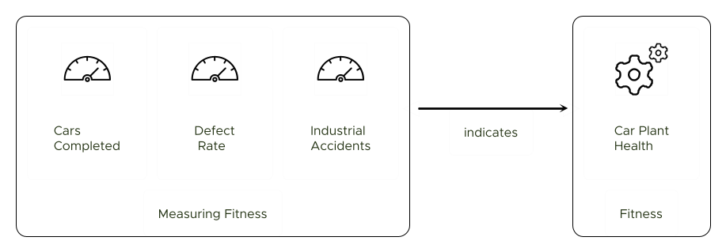
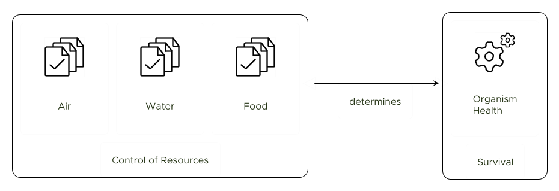
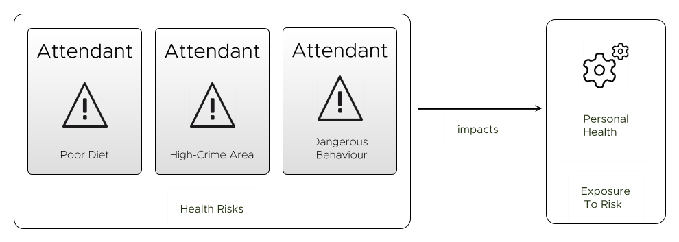
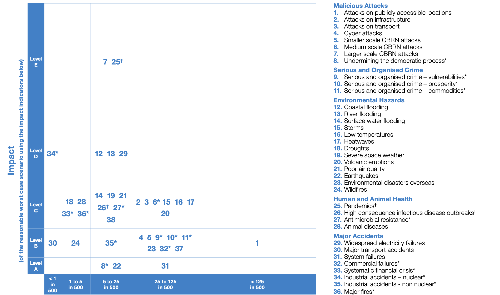

# Health and Risk

As we saw in the last section, [Evaluating Risk](Evaluating-Risk.md), people in industries like banking and insurance think mainly about risk measured in _money_.  But risk isn't just money.  Life is filled with non-monetary risks:

> "If someone says, 'You can make it!' down a vertical mountain when you don't ski very well, think about it before launching. This can be a turning point in your life. It sure was in mine when I slammed into the mountain.   I wish I'd said, 'F'getabout it, sucka,' and gone to the Kiddie Corral. Would have saved a lot of pain and surgery.  Think about this. What are you really up for? Is the thrill worth the cost?"  — Sandy Nathan

I am going to argue in this section that _risks_ are things that affect the health of a thing, where the thing could be:

 - **A Living Organism**, such as the human body, which is exposed to _health risks_, such as [Cardiovascular Disease](https://en.wikipedia.org/wiki/Cardiovascular_disease) or [Parkinson's Disease](https://en.wikipedia.org/wiki/Parkinson's_disease).  
 
 - **A Software Product** is a thing we interact with, built out of code.  As we saw in [Development Process](Development-Process.md), the health of that software is damaged by the existence of [bugs](../risks/Feature-Risk.md#implementation-risk) and [missing features](../risks/Feature-Risk.md#feature-fit-risk).
 
 - **A Project**, like making a film or organising a [dinner party](A-Simple-Scenario.md). 
 
 - **A Commercial Entity**, such as a business, which is exposed to various [Operational Risks](../risks/Operational-Risk.md) in order to continue to function.  Businesses face different health risks than organisms:  [key staff leaving](../risks/Agency-Risk.md#the-hero), [reputation damage](../risks/Communication-Risk.md#trust--belief-risk), [running out of money](../risks/Scarcity-Risk.md#funding-risk) and so on.

 - On a larger scale, **a State** is a system, the health of which is threatened by various existential risks such as revolution, climate change, nuclear war and so on.
 
These examples are all at different scales, and could be nested within each other.   You might be working on a software product for a team inside an organisation operating in a certain country.   You are probably going to have to consider the health of more than one of those things _as well as your own health_.  Sometimes, as discussed in [Agency Risk](../risks/Agency-Risk.md) these can be in conflict with one another. 
  
## What Is Health?

Health is a really universal property: it seems like you can talk about the health of nearly everything: I can talk about the health of soil (how likely things are to grow in it), of a table (whether it might collapse or not), a tree (whether it looks nice and is growing) or a political party (whether it's membership is strong and growing).  

However, in all these cases, health refers to something slightly different, perhaps subjective.  It's an overloaded term, so let's look at some specific meanings for health.

### Health as Survival

The most obvious indicator of health in _living things_ is whether they're alive or dead.  But since there is no clear definition of exactly [what a living thing is](https://en.wikipedia.org/wiki/Life), scientists fall back to describing the _behaviours_ of living things, such as [metabolism](https://en.wikipedia.org/wiki/Metabolism) (taking in energy or other inputs, and using it to self-organise), [homeostasis](https://en.wikipedia.org/wiki/Homeostasis) (having some kind of feedback loops to maintain an internal state) or [adaptation](https://en.wikipedia.org/wiki/Cellular_adaptation) (responding to changes in the environment).

When a living thing is no longer exhibiting these behaviours, it is dead.  But, the same is true of our other examples too:  businesses go bust, projects get cancelled, dinner parties end.  At the larger end of this scale, we can say that a country or a project is alive so long as there are people participating in it:  to be alive, the constituent components must be alive too.

The problem with "Alive vs. Dead" is that it is binary - there is no scope for "improving" or "worsening" health.  I could be involved in an accident that severely limits my capability, but leaves me alive - my health is definitely worse though.

### Fitness

A different approach to judging the health of a thing might be to take measurements of it and compare it to other things.  For example, we could say the health of a battery is related to the amount of charge it contains compared to a new battery, or the health of soil by the quantity and quality of crops it produces compared to some average of other soils.  

 - For **people**, you can measure health by looking at things like resting heart rate, blood pressure, lung capacity and so on.  Also, there are tools like the [SF-36](https://en.wikipedia.org/wiki/SF-36) which aim to capture (via survey) the general health of people, by asking them about their physical and mental functioning, emotional well-being, stress etc.

 - For **a business** (say, a car factory) you could create metrics for the number of cars completed, the defect rate, the number of workplace accidents per year and so on.  

 - For **a software product** you could look at things like number of users, licenses, downloads or some other metric.  
 
 - If you're in a **development team** which is working on new software, you could look at something like [Burn Rate](https://en.wikipedia.org/wiki/Burn_rate).

Metrics are difficult though.  Choosing the _right_ metrics, knowing their weaknesses and being aware of what knowledge is missing is a whole other discussion which we look at in [Map And Territory Risk](https://riskfirst.org/risks/Map-And-Territory-Risk).  Taking the car plant example again, what does it mean to produce a hundred cars a day?  Is it good or bad?  Is this directly tied into how healthy our business is?  Does it matter if the cars aren't selling?

### Critical Acclaim

Measuring fitness as you go along is not always possible.  For a lot of projects, like dinner parties, films, construction projects, the success or failure has to be judged subjectively on completion, and not before.  Essentially, the project is a [bet](Glossary.md#bet) on a future outcome. 

Building a new feature on a software project fits into this category:  although you can build tests, do demos and run beta-test programmes the full picture of the health of what you've built won't emerge until later.  Setting up effective feedback loops is the subject of the next section, on [cadence](Cadence.md).

### Power and Safety

Although you might not have visibility of the end result, sometimes it's enough to care about the health of the process itself.  So another perspective on health is that it relates to control of resources:  does the project/person/business control of the resources it needs to survive?   

When we consider health in these terms, it makes sense that risk is usually measured in money, since if you have money, you can usually spend your way out of trouble.   But there are plenty of things money can't buy - if you are lost in a desert then no amount of money is going to help you find safety - your resources are limited to what is around you.  Lots of health problems _can't_ be solved just with money.  

When talking about **businesses**, economists call these resources [Factors of Production](https://en.wikipedia.org/wiki/Factors_of_production), dividing them into categories like land, labour and capital.  

The resources of **a state** are employed to create some kind of organisation (feed armies, build roads, create currency, run governments), whether it is a democracy or a dictatorship.  When the resources dry up or are stolen, the state can fall apart resulting in civil wars and anarchy.  Leaders of states need to understand which resources are the sources of their power.  CGP Grey's excellent [Rules for Rulers](https://www.cgpgrey.com/blog/rules-for-rulers) video explains how this works in great detail, and covers why government doesn't always do the best things for it's subjects. 

### Risk Exposure

Simply looking at "Survival, "Fitness" or "Resources" isn't the whole story of health.   Personally, I might be perfectly happy and (apparently) healthy one moment, but then fall down dead from heart failure the next due to some inherited heart condition.  Was I, in fact, healthy?  Similarly, I could live happily on an island with plenty of food, and have it all washed away overnight in a storm.  Health isn't just about considering where you are now, but also how _precarious_ the position might be.

So, we have to go further and consider - what are the health risks I am exposed to?   What are the risks due to my environment, my diet, my behaviour?   If I live in a high-crime area, in a high-fire-risk house, engaging in lots of dangerous activities then this should be taken into account when judging my health.

#### ... For A Commercial Entity

It is the same for a **commercial entity** too.  Looking at metrics doesn't tell you whether your business is about to be obsoleted by a new invention, or whether your factory is about to turn into a human tragedy (such as in the [Bhopal Disaster](https://en.wikipedia.org/wiki/Bhopal_disaster)).

Just as human health-risks are relatively well-known and documented, an understanding of the risks to **commercial entities** has been built up over time. Accounting requires a certain set of measurements (all measured in monetary units), which are the same for all companies:

 - A **Balance Sheet**, showing what the company owns and owes.  This is used for reporting [Funding Risk](https://financial-dictionary.thefreedictionary.com/Funding+risk) - that is, does the company have too much debt, given its assets?  
 - A **Profit and Loss Statement**, showing whether the company is making or losing money from the deals it does.  Companies that consistently lose money will die, so this is a statement that helps investors know what risks they face.  This kind of transparency helps reduce [Agency Risk](../risks/Agency-Risk.md) for investors.
 - A **Cash Flow Statement**, shows the company's cash position and how much cash is entering and leaving the company.  This is important for managing [Liquidity Risk](https://en.wikipedia.org/wiki/Liquidity_risk) - the short-term requirement of cash on-hand to keep the business running.  Some companies can be hugely profitable, but nevertheless fail due to lack of cash. For example, [Northern Rock](https://en.wikipedia.org/wiki/Northern_Rock) failed in the 2007 financial crisis as it was unable to cover short-term payments.

All of these are measured in monetary amounts, but each addresses a different risk.   A healthy commercial entity will be managing all of these kinds of monetary and [non-monetary](../risks/Operational-Risk.md) risks.

#### ...For A Software Project

Over time, as a species, we have built up a detailed body of knowledge on the risks that afflict _human_ health, as well as the ones that affect the health of _commercial entities_.  

The purpose of [Risk First](https://riskfirst.org) is to try to build that body of knowledge for software development.  Risks are in general _not_ unique on software projects - they are the same ones over and over again, such as [Communication Risk](../risks/Communication-Risk.md) or [Dependency Risk](../risks/Dependency-Risk.md).  Every project faces these.  

A complete [Pattern Language](https://riskfirst.org/risks/A-Pattern-Language) covering all the main categories of risks you face on a software project starts [here](https://riskfirst.org/risks/Start).

#### ...For A State

On to the last example: how healthy is the United Kingdom?  It might seem unlikely, but as well as producing the _fitness metrics_ (such as GDP, employment, education level, health indicators for the inhabitants) the UK government also produces a [National Risk Register](https://www.gov.uk/government/publications/national-risk-register-2020), which considers various risks (flooding, fires, pandemics, nuclear attack) and produces a matrix comparing:

 - **Impact**  This is an `A-E` scale. `A` means a risk costing < £10m and killing < 8 people.   An `E` impact (the largest), meanwhile has a > £10b cost and > 1000 deaths.  According to this reckoning, pandemics and CBRN (chemical, biological, radiological and nuclear) attacks have the greatest impact.
 - **Likelihood**: This is based on a probability out of 500, again banded into sections.  The lowest risks (1/500) only contains a major transport accident, whilst lots of terrorist attacks exist in the 25-125/500 band.

Why would they produce such a report?  From their introduction:

> "The 2020 National Risk Register sets out the range of risks and challenges we face which have the potential to cause significant disruption to the UK, and explains what the government and partners are doing to mitigate these risks and how we all can prepare for and respond to them"

This is about the health of a nation:  _tracking the risks you face_ and then _managing them_ are an important way to stay healthy.

If we do this for _personal health_, _corporate health_ and _societal health_, is it not clear that this is a good practice to perform at the level of a software project?

The next two sections focus on how to do this:  in the next section, [Cadence](Cadence.md) we will look at the importance of feedback loops on monitoring the risks you face.  Then in [De-Risking](De-Risking.md) we will look at general strategies for managing risks on software projects.

On to [Cadence](Cadence.md)...

  

 